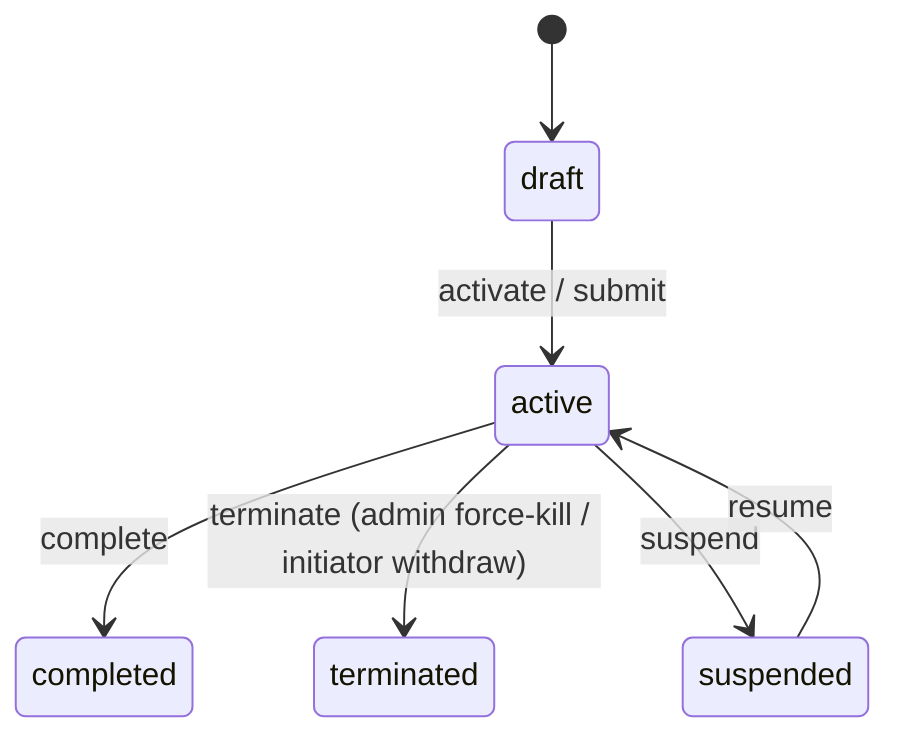

# wf_instance Runtime Process Instance Table

<div class="lead">
One approval request = one row. Stores only "in-progress" instances; once ended, the entire row is migrated into wf_hi_instance.
</div>

## Table Structure

| Field | Type | Description |
|---|---|---|
| `id` | VARCHAR(36) PK | Instance UUID |
| `process_id` | VARCHAR(36) | **The id of the process definition version row** (runs against a pinned version) |
| `business_key` | VARCHAR(200) | Business key (the business system's unique number, e.g. an expense claim number) |
| `name` | VARCHAR(200) | Instance name (e.g. "Wang Qiang's leave request") |
| `start_user_id` | VARCHAR(36) | Initiator user ID (empty string when triggered by the system) |
| `status` | VARCHAR(20) | `draft` (draft; becomes `active` after activation) / `active` / `completed` / `suspended` / `terminated` (`cancelled` / `failed` are reserved enum values with no write path in the current version) |
| `variables` | TEXT | **Process variables JSON** — the submitted form data is packed under `msg` and can be added to or modified during execution |
| `current_activity` | VARCHAR(100) | Node definition ID where execution currently sits |
| `priority` | INTEGER | Priority (higher = more urgent, default 50) |
| `parent_id` | VARCHAR(36) | Parent instance ID — **links a subprocess back to its main process** |
| `tenant_id` | VARCHAR(100) | Tenant ID (SaaS multi-tenant) |
| `created_by / created_at / updated_by / updated_at` | — | Audit |
| `end_reason` | VARCHAR(2000) | Completion/termination reason (includes error details) |
| `duration` | BIGINT | Running duration (milliseconds) |
| `ended_at` | TIMESTAMPTZ | End time |

Indexes cover the high-frequency query dimensions: `status`, `tenant_id`, `business_key`, `parent_id`, `created_at DESC`, `priority DESC, created_at ASC` (to-do list / claim ordering), plus the composite indexes `(tenant_id, status, created_at DESC)` (admin lists) and `(tenant_id, start_user_id)` ("initiated by me").

## variables: Form Data as Process Variables

The form values submitted at initiation are packed wholesale into `variables`:

```json
{ "days": 5, "reason": "Family matters", "managerId": "mgr001" }
```

- Conditional gateways (`switch`) read them through expressions such as `msg.days`
- `userTask` candidate configuration can be resolved from variables via `${msg.xxx}` (e.g. scenarios where the initiator picks the approvers)
- AI/HTTP/automation nodes likewise fetch values via `${msg.xxx}`

## Subprocess

A `subProcess` node creates a new instance whose `parent_id` points to the main instance; after the subprocess finishes its own end node, the result variables are carried back to the main process and execution continues.

## Lifecycle



The moment it ends: the row migrates into `wf_hi_instance`, back-filling `duration` / `ended_at` / `end_reason`; on withdraw, `end_reason` records "Withdrawn by applicant".

::: tip Back to the [Data Model Overview](/en/guide/data-model/)
