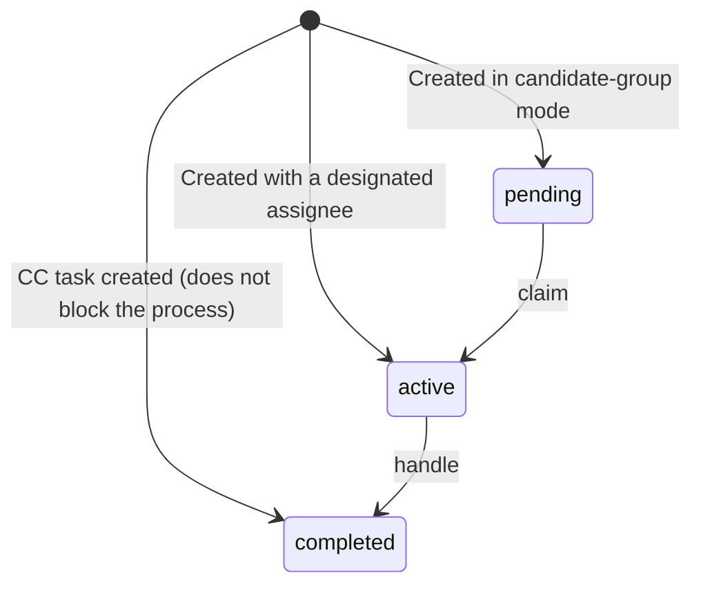

# wf_task Runtime Task Table

<div class="lead">
One "thing that needs a human to handle" = one row. OR-sign, countersign, add-sign, and delegate all close the loop on this single table — it keeps only in-progress tasks, and only the minimal field set needed to handle them.
</div>

## Table Structure

### Identity and Ownership

| Field | Description |
|---|---|
| `id` | Task UUID |
| `process_instance_id` | Owning instance (**empty for standalone tasks**) |
| `process_id` | Process definition version |
| `task_type` | Task type: column default `user_task`; at runtime the producing node's type is written, e.g. `userTask` approval / `ccTask` CC / `delay` delay |
| `task_def_key` | Node definition ID (the node id in the DSL) |
| `name` / `description` | Task name and description |
| `tenant_id` + the four audit columns | Tenant isolation and audit (same as the other wf_* tables) |

### State Machine

| Field | Description |
|---|---|
| `status` | Full set: `created` / `assigned` / `waiting` / `pending` / `active` / `delegated` / `completed` / `returned` / `withdrawn` / `suspended` / `terminated`. Initial value depends on the creation scenario: designated assignee → `active`; candidate-group mode → `pending` (`active` after claim); CC task → `completed` right away |
| `assignee` | Current handler |
| `owner` | Owner (the original handler **before delegation**) |
| `claimed_at` | Claim time (empty = not yet claimed; used for claim/grab) |

### Countersign and Add-Sign (Core)

| Field | Description |
|---|---|
| `parent_id` | **Parent task ID** — add-sign creates child tasks attached under the main task; countersign gets one row per person |
| `sequence_order` | Countersign sequence number (sequential countersign child tasks are ordered by this; 0 = main task or non-countersign) |
| `approval_type` | `single` single person / `or` OR-sign / `sequential` sequential / `vote` vote / `countersign` countersign / `system` system / `cc` CC; add-sign child tasks inherit the parent task's `approval_type` |
| `approval_rule` | Countersign rule JSON: `{"type":"all|any|majority|percent|count","value":threshold,"isSequential":bool}` |

### Handling and Timeout

| Field | Description |
|---|---|
| `form_key` | Associated form |
| `variables` | Task-level variables (modifiable at runtime, e.g. add-sign remarks, transfer audit trail) |
| `due_date` | Due time (gflow periodically scans for tasks whose `due_date` is overdue and sends in-app reminders) |
| `priority` | Priority, used for to-do sorting |

### Delegation and Transfer Audit Trail

- **Delegate**: `delegate_from` / `delegate_reason` / `delegate_time` land in the table directly as three columns
- **Transfer**: `transfer_from` / `transfer_reason` / `transfer_time` are written into `variables`

### Completion Fields

`ended_at` / `comment` (task comment) / `end_reason` / `duration` (elapsed time in milliseconds).

## Status Overview



An in-flight task (active / pending) can be suspended (`suspended`) and resumed; sent back → `returned`; withdrawn; voided as `terminated` when the owning instance terminates.

## How Add-Sign Is Stored

When the manager adds a front approver zhangwei during approval:

```
wf_task: main task (parent_id=NULL, status=active)
wf_task: child task (parent_id=main task, sequence_order=1, assignee=zhangwei)  ← approves first
```

The engine guarantees that the parent task produces no outcome until all child tasks on the chain are completed — that is the entire storage implementation of add-sign, with no extra tables.

## Index Design

- `process_instance_id` — task list on the instance detail page
- `assignee`, `status` — single-column indexes each; my-todo queries combine them as needed
- `due_date` — overdue scanning
- `priority DESC, created_at ASC` — to-do sorting
- `tenant_id`, `(process_instance_id, task_def_key, sequence_order)` — tenant isolation and process-level tracing
- `(parent_id, sequence_order)` — countersign/add-sign chain (partial index, `parent_id IS NOT NULL`)

::: tip Back to the [Data Model Overview](/en/guide/data-model/)
