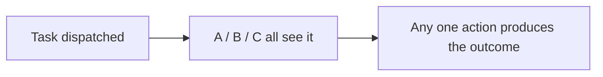
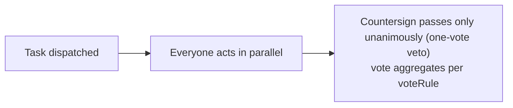
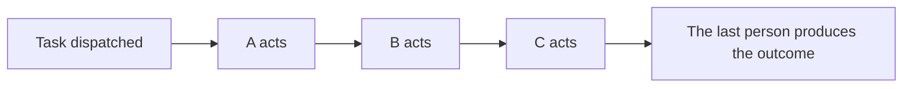

# Chinese-Style Approval Semantics

<div class="lead">
Add-sign, reject, countersign, transfer, withdraw — these native semantics that give foreign BPMN engines a headache are first-class citizens in GFlow Engine. Every action closes the loop on <code>wf_task</code> and is exposed through the REST API and the Go API.
</div>

<script setup>
const matrixGroups = [
  {
    title: 'Approval modes',
    items: ['Single approver single', 'OR-sign any (any one approves)', 'Countersign all (one-vote veto)', 'Sequential approval sequential', 'Vote vote (ratio/count)', 'System task', 'CC'],
  },
  {
    title: 'Vote thresholds',
    items: ['Majority majority (default)', 'Percentage percent', 'Fixed votes count'],
  },
  {
    title: 'In-flight actions',
    items: ['Add-sign', 'Remove-sign', 'Transfer', 'Delegate', 'Claim / grab', 'Return to previous node', 'Withdraw', 'Comment', 'Attachments'],
  },
  {
    title: 'Approver types',
    items: ['Specific members', 'Role', 'Department', 'Direct manager', 'Multi-level manager', 'Initiator-selected', 'The initiator themselves'],
  },
  {
    title: 'Instance-level operations',
    items: ['Suspend', 'Resume', 'Terminate', 'Withdraw application', 'Timeout urge', 'Priority', 'Process tracking'],
  },
  {
    title: 'Self-approval policy (approver = initiator)',
    items: ['No filtering none (default)', 'Remove initiator skip', 'Keep initiator autoApprove', 'Route to direct manager', 'Route to department manager'],
  },
]
</script>

<CheckMatrix :groups="matrixGroups" />

## Approval Modes (approveMode)

Values for the node's `configuration.approveMode` (persisted as the same value into `wf_task.approval_type`); the enums are case-sensitive exact values:

| approveMode | Pass rule | Description |
|---|---|---|
| `single` | The assignee's action produces the outcome | Default value; `assignee` is a single handler |
| `any` | **Passes as soon as any one approver approves**; a single rejection rejects it | All candidates receive the task simultaneously; first to act wins |
| `all` | Everyone must approve; one-vote veto | Everyone approves in parallel and every vote counts |
| `sequential` | The next person receives the task only after the previous one has finished | The engine creates single-person tasks one at a time on demand; until the previous person produces an outcome, the task is invisible to the next |
| `vote` | The outcome follows the `voteRule` threshold | Everyone votes in parallel; a good fit for review and voting scenarios, see the table below |

`system` / `cc` are approval types used internally by the engine (system auto tasks and CC tasks); `userTask` nodes do not accept these two values.

How the multi-person modes differ at runtime:

**OR-sign any** — everyone sees the task at once, first to act wins:



**Countersign all / vote vote** — everyone acts in parallel, then ballots aggregate:



**Sequential sequential** — serial, person by person; until the previous person produces an outcome the next one sees nothing:



## Vote Thresholds (voteRule)

With `approveMode: vote`, the pass threshold is written to `configuration.voteRule` and persisted into `wf_task.approval_rule` (JSON):

| Field | Type | Description |
|---|---|---|
| `type` | string | Threshold type: `majority` / `percent` / `count` |
| `value` | float | The rule value: `percent` takes 0–100; `count` is a fixed number of votes; `majority` ignores it |

Details of the `type` thresholds (when `voteRule` is unset, `majority` applies):

| type | Pass condition | Reject condition |
|---|---|---|
| `majority` | Majority approves (`total/2+1`) | Majority rejects |
| `percent` | Approval share of votes ≥ `value` (in percent, rounded up: 60% of 3 people requires 2 votes) | Rejected once reaching the threshold is mathematically impossible |
| `count` | Number of approval votes ≥ `value` | Rejected once reaching the threshold is mathematically impossible |

Typical combinations:

```json
// vote · majority pass (the default; voteRule can be omitted)
{ "type": "majority" }

// vote · 60% approval (review voting)
{ "type": "percent", "value": 60 }

// vote · at least 3 approval votes
{ "type": "count", "value": 3 }
```

> `vote` is a parallel ballot where the first to claim acts first (see Claim / grab below); for one-by-one handling use `approveMode: sequential`.

## When the Approvers Include the Initiator (Self-Approval Policy)

When the initiator appears in the approval chain, the node's configured `selfApproval` decides what happens:

| selfApproval | Behavior |
|---|---|
| `none` | Default, no filtering; the initiator stays in the approver list as usual |
| `skip` | Remove the initiator and go straight to the next node (an `initiatorSelf` approver paired with `skip` leaves nobody to review and is rejected by deploy-time validation) |
| `autoApprove` | Keep the initiator (a reserved auto-approve semantic; the current implementation does not filter) |
| `delegateToManager` | The initiator's task is handed to their direct manager |
| `delegateToDeptManager` | The initiator's task is handed to the department head |

## Approver Resolution

Tasks are created from the node's `configuration.approver` `type`. The candidate pool (`wf_task_assignee`) stores only the original references, which are expanded through `IdentityService` at query time:

| approver.type | Resolution |
|---|---|
| `user` | `userIds` provides user IDs directly |
| `role` / `dept` | Looks up users by role/department, producing to-be-claimed tasks |
| `manager` | The initiator's Nth-level manager via `levels` (level 1 by default) |
| `multiLevelManager` | The initiator's managers across multiple levels: `levels > 0` pins approval at level N, `levels < 0` walks up to the top |
| `initiatorSelect` | Chosen by the initiator at submission: the `expression` template (e.g. `${msg.selectedUsers}`) resolves the approvers from process variables |
| `initiatorSelf` | The initiator themselves (self-approval scenario) |

## Actions During Processing

### Add-sign / Remove-sign

Dynamically insert approvers mid-approval (add-sign) or remove add-sign / countersign members who have not yet acted (remove-sign). Add-sign uses **before add-sign** semantics: the newly added signers review first, and the original approver produces an outcome only after all add-sign subtasks are complete. The engine maintains the parent-child task chain via `wf_task.parent_id + sequence_order`; add-sign creates child tasks, and the main task waits until every task on the chain has finished.

Remove-sign only touches subtasks that have **not yet been acted on** — members who already produced an outcome cannot be removed. On countersign / vote nodes the remaining ballots are re-evaluated after removal: once they already meet the threshold the node resolves and the flow continues; removing everyone (nobody left to review) terminates the instance. Removals are recorded via the `ReduceSign` event for audit / notification.

### Return (Send Back)

A task can be returned to the **last completed approval node** for re-processing:

- The return target is fixed to the most recently completed `userTask` (you cannot pick a target across nodes, nor return directly to the initiator)
- The returned task is archived as `returned`, the target node's task is rebuilt, and the form data and variables are carried back along with it
- When you need to "return to the initiator", configure the node's reject as `reject.strategy: toStarter`

### Transfer / Delegate

Both hand the task to someone else — the difference is **who produces the final outcome** (the end-user walkthrough lives in the [Approval Actions Guide](/en/guide/features/approval-actions)):

- **Transfer**: the task is handed to someone else for good; the assignee changes, the original approver is out, and the new assignee's approval moves the flow on. An audit trail is written to the task variables `transfer_from` / `transfer_reason` / `transfer_time`
- **Delegate**: the delegatee reviews first, while `owner` keeps the original owner and `delegate_from` is persisted as an audit trail. When the delegatee approves or rejects, the task does **not** advance — it returns to the original approver automatically with a notification (`TaskEventResolved`), and the delegatee's comment stays on the timeline; the original approver then reviews once more to produce the final outcome. Delegating to yourself is rejected

### Claim / Grab

Role/department candidate tasks are first come, first served: anyone in the candidate pool can claim the task (`claimed_at` records the time), and once claimed no one else can process it.

### Withdraw

The initiator can **withdraw** an in-flight application: the instance terminates (status `terminated`, `end_reason` records "withdrawn by applicant"), in-flight tasks are voided, and afterwards the form can be modified and the request initiated again.

## Instance-Level Operations

| Operation | Instance state | Description |
|---|---|---|
| Suspend / Resume | `suspended` → `active` | Pauses all unprocessed tasks; on resume, each node resumes on its own without losing the parent context |
| Terminate | `terminated` | Force-killed by an administrator; `end_reason` is recorded |
| Complete | `completed` | Finishes normally through the end node and is archived into the history tables |

**Upcoming node forecast (`upcoming`)**: the detail response of a live instance carries an `upcoming` field — walking forward from the active nodes along Success edges, it forecasts the upcoming approval nodes (`nodeId` / `nodeName` / `approverType` / `assignees` / `unresolved`). The forecast is not a promise: transfers and add-signs can change the actual path; it truncates at conditional branches, and initiator-selected nodes report `unresolved: initiatorSelect` until the variables settle.

## Timeout (timeout)

The node's `configuration.timeout` (`dueInMinutes` deadline duration + `action`) determines how overdue tasks are handled. The duration is measured **from the moment each task is created** and executed by the host's overdue sweep (the gflow platform scans in-flight tasks whose `wf_task.due_date` has expired every 30 minutes):

- `remind` (default): sends an in-app reminder through the built-in notification center without changing the task state
- `autoApprove`: auto-approves the overdue task as the system and the process continues
- `autoReject`: auto-rejects as the system and routes according to the node's reject configuration

`due_date` can also be set manually via the `TaskService.SetDueDate` Go API. For multi-instance nodes (sequential approval), each subsequent subtask re-evaluates `dueInMinutes` based on **its own creation time**, so the whole chain never shares a single static deadline. When embedding the engine directly (without the gflow platform), the host must implement the scan logic itself (refer to gflow's overdue scanner).

## Reject (reject)

The node's `configuration.reject` decides where the flow goes when an approval is rejected:

```json
{ "strategy": "toNode", "target": "node_supplement" }
```

| strategy | Behavior |
|---|---|
| `terminate` | Terminates the instance (default) |
| `toStarter` | Jumps back to the start node (returns to the initiator to revise and resubmit) |
| `toPrev` | Jumps to the previous `userTask` node for rework |
| `toNode` | Jumps to the node named by `target` (required; must be a node ID that exists on the chain) |

If the jump target is unreachable (conditions unmet, edge missing, etc.), it falls back to the node's Reject / Failure outgoing edges; with no outgoing edges either, the instance terminates. In multi-person modes, any single rejection triggers the reject (OR-sign first-to-act wins; countersign is a one-vote veto).

## CC

The `ccTask` node produces CC records (without blocking the process) and fires the `CCTaskCreatedListener` callback; the gflow frontend has a "CC'd to me" list where CC recipients can comment.

## Action Permissions

Each `userTask` can finely toggle the actions available to its approver via `additionalInfo.actionPermissions`. **Approve and reject are forcibly enabled by the backend and cannot be turned off**; all other actions are off by default and must be enabled explicitly:

```json
{
  "transfer": true,
  "return": true,
  "delegate": true,
  "addSign": true,
  "reduceSign": true,
  "urge": true,
  "uploadAttachment": true
}
```

On the initiator side there are additional instance-level switches such as `suspend` / `withdraw` / `terminate` / `resubmit`. All of these are configured visually, node by node, in the Process Designer.

## Deploy-Time Validation

At deploy/update time the engine validates every node's `configuration`: unknown values, missing required fields, and mutually exclusive combinations (a vote threshold on a non-vote node, `toNode` without `target`, etc.) **reject the deployment outright** with a node-level error message — configuration errors are caught before writing, not at runtime.
