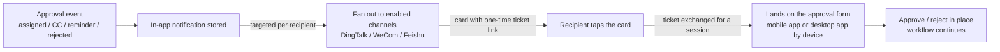

# IM Work Notifications & Link-Based Approval

<div class="lead">
Stop chasing approvers. To-dos, CCs and reminders are pushed in real time to DingTalk, WeCom and Feishu work notifications — tap the card, land on the approval form without signing in, approve on your phone, and the workflow moves on.
</div>

## What problem it solves

Approval systems rarely die from missing features — they die because **approvals sit inside the system while people don't**. To-dos pile up unseen, requests stall for a day in someone's queue, finance chases, submitters wait, and someone ends up forwarding screenshots in a group chat.

| Common pitfall | How GFlow handles it |
| --- | --- |
| To-dos live only inside the system; no ping, no action | Approval events are pushed as **work notifications** straight to the assignee's DingTalk / WeCom / Feishu |
| Tapping a notification still demands a login, worse on mobile | The card link **lands on the form without signing in** — silent in-app login for DingTalk / WeCom containers |
| Group-bot broadcasting puts approval links in a group — first tap wins, and nobody can tell who acted | Messages are **targeted to one person**; links carry a one-time ticket that dies when forwarded, and every action is taken inside the system with a full audit trail |
| IM accounts and system accounts are two worlds, kept in sync by hand | **Directory sync** pulls the org tree automatically and binds members by mobile number; leavers are disabled automatically, re-running sync re-binds fixed records |
| Three platforms, three protocols, three sets of credentials and rate-limit traps | One **admin page** for all credentials, effective immediately; built-in retries and rate limiting |
| Messages vanish into the void — did anyone get it? | Every outbound message has a **delivery record** (sent / failed / skipped); failures retry automatically with the platform error surfaced |

## Keep the habits, keep the data

- **Zero learning curve for employees**: the approval entry lives inside DingTalk / WeCom / Feishu — no new app, no new password, no training. The notification arrives, they tap, they act. Work as usual.
- **Data stays on your servers**: gflow is a self-hosted system — forms, attachments and audit trails never leave your machines. IM is just the doorbell: messages carry only the title and an action link; business details stay inside by default.
- **No IM lock-in**: one configuration model for all three platforms. Switch from DingTalk to Feishu tomorrow and your workflows and documents stay untouched.

## Capability matrix

| | DingTalk | WeCom | Feishu |
| --- | --- | --- | --- |
| Notification form | Work notification (card, whole-card link) | App message (card) | Bot message card |
| Directory sync | ✅ departments + members (incl. mobile) | ✅ departments + members (mobile via reverse lookup) | ✅ departments + members (incl. mobile) |
| In-container login | ✅ silent | ✅ silent (requires an ICP-filed trusted domain) | via ticket link |
| Per-tenant credentials | ✅ | ✅ | ✅ |

Only **one IM platform is active at a time** (pick one of three, switch anytime — enabling a new platform automatically disables the current one and keeps its data); the two items under "Your own systems" enable independently. With no channel configured, outbound delivery stays off and in-app notifications are unaffected.

## How it works



- **Targeted to a person**: each notification is delivered individually to the recipient's bound identity (DingTalk userid / WeCom userid / Feishu open_id). Unbound recipients are skipped on that channel; in-app notifications are unaffected.
- **Link safety**: the embedded ticket is bound to the recipient, single-use, valid for 7 days — forwarded links simply don't open.
- **Restrained content**: only the title and the action link go into the IM. Business details (amounts, reasons) stay out by default and can be opted in.

## Enable it in three steps

DingTalk or Feishu is the quickest start (about 5–8 minutes each, no domain needed); WeCom messaging is just as easy, but its in-card login-free access needs an ICP-filed domain — configure WeCom last if you go that far.

### Step 1: create the enterprise app and grant permissions

#### DingTalk (about 5 minutes)

1. Sign in to the DingTalk developer console [open-dev.dingtalk.com](https://open-dev.dingtalk.com) → App development → Internal development → Create app.
2. On the "Credentials & basic info" page, collect **AppKey, AppSecret, AgentId**; CorpID sits under "Enterprise info" in the top-right corner (it is not the AppKey).
3. In "Permission management", search and enable:

| Permission (official name) | Used for |
| --- | --- |
| Address book department info read | department sync |
| Address book department member read | member sync |
| Member info read | member details |
| **Employee mobile number** | returns mobile numbers — without it nobody can auto-bind |
| Personal identity info | account binding |

4. Work notifications and in-container login are **enabled by default** for internal enterprise apps — nothing to apply for.

#### WeCom (about 8 minutes)

1. Sign in to the WeCom admin console [work.weixin.qq.com](https://work.weixin.qq.com) → App management → Self-built → Create app; collect **AgentId** and the app **Secret** (viewing it sends the value to the WeCom mobile app).
2. My company → Enterprise info → copy the **enterprise ID** (CorpID).
3. Set the app's **visible range to everyone**: directory reads and messaging are both bounded by it — an unopened range is the most common cause of "0 people synced / messages not delivered".
4. Permissions: self-built apps are callable by default, **no per-scope grants needed**; leave gflow's "directory Secret" empty (that Secret mandates a trusted IP and only adds a failure point).
5. Trusted IP: if API calls fail with 60020, add the gflow server's outbound IP to the app's "trusted IP" list (the entry unlocks after a receive-message URL or trusted domain is configured).
6. In-card login-free access (optional): set a trusted domain under "Web authorization & JS-SDK" — the domain must be **ICP-filed** and pass ownership verification (upload the verification file to the domain root); IP addresses and intranet hosts won't work. Skip it if you have no filed domain — messaging is unaffected and links fall back to password login.

#### Feishu (about 8 minutes)

1. Sign in at [open.feishu.cn](https://open.feishu.cn), open the developer console → create a custom enterprise app; collect **App ID, App Secret** on the "Credentials & basic info" page.
2. App capabilities → Add capability → add the **bot** (messaging fails with 230006 without it).
3. In "Permission management", search and enable:

| Permission (official name) | Used for |
| --- | --- |
| Get basic contact info `contact:contact.base:readonly` | department & member sync |
| **Get user phone number `contact:user.phone:readonly`** | returns mobile numbers — without it nobody can auto-bind |
| Get & send single/group messages `im:message` | bot message cards |

4. App release → Availability → set to **all employees**, then Version management → create a version and apply to publish (self-built apps are approved by your own enterprise admins — usually the creator). **Without publishing, none of the permissions take effect** (errors 230013 / 40004).

### Step 2: enter credentials in GFlow

Sign in to GFlow → **System Management → IM Integration** → the "Identity integration" card → the "IM platforms (pick one of three)" group → click **Configure** on an unconfigured platform card (or Edit on a configured one), fill in per the table below and save.


| gflow field | DingTalk | WeCom | Feishu |
| --- | --- | --- | --- |
| CorpID | enterprise CorpId | enterprise ID | — |
| AppKey | AppKey | — | — |
| AgentID | AgentId | AgentId | — |
| App ID | — | — | App ID |
| AppSecret | AppSecret | app Secret | App Secret |
| Directory Secret | — | **leave empty** | — |
| API base URL | empty (official) | empty (official) | empty (official) |

- Takes effect **immediately**, no restart. Secrets are write-only — leaving them blank keeps the stored value; the remaining switches can stay at their defaults.
- **Pick one of three**: only one IM platform is active at a time. Saving or enabling a new platform while another one is in use asks for a switch confirmation — after confirming, the previous platform is disabled automatically, directory sync and messaging move to the new platform, and the previous platform's synced departments, accounts and bindings are **kept**; once you no longer need them, use "Purge data" on its card.

**Card states and buttons**:

| Card state | Meaning | Actions on the card |
| --- | --- | --- |
| Not configured (dashed) | no credentials yet | **Configure** (opens the drawer) |
| Disabled | configured but not enabled | **Edit** / **Enable** / **Purge data** |
| Active (green) | the platform currently in effect | **Sync now** / **Edit** / **Disable** / **Purge data** |

- **Enable**: puts the platform to work; if the secret is missing you'll be prompted to fill it first — otherwise sync and notifications won't work.
- **Disable**: stops that platform's directory sync and message delivery; everything already synced (departments, accounts, bindings) is kept.
- **Purge data**: removes user bindings synced from that platform and disables its synced departments and auto-provisioned accounts (historical approvals are untouched); a re-sync rebuilds them from the current org chart.
- **Tenant isolation**: each tenant sees and configures only its own credentials on this page — there is no globally shared default configuration, and tenants cannot see each other's setups.

### Step 3: sync the directory, bind automatically

On the active platform card (the green "Active" one), click **Sync now**; the summary line on the card shows the time and result of the latest run.


> Re-running a sync resets all counters to zero — sync is idempotent and never duplicates data.

- Pulls the full org tree and members and **binds automatically by mobile number**; unmatched counts are shown in the sync result.
- Unmatched > 0: fill in the user's mobile number under System Management → Organization → run sync again (idempotent, safe to re-run).
- A full sync runs automatically every night; leavers are disabled (never deleted — historical documents keep their references).

Binding management: System Management → Organization → a user's "More → IM bindings" shows the binding status and allows unbinding. An unbound user stops receiving that platform's work notifications; re-running sync or a login-free visit re-binds automatically.


The "Generic directory source" card under "Your own systems" connects your own account system — see [below](#connect-your-own-system-generic-directory-source-optional).

Once bound, the next approval event lands in the member's IM:


## Free login: tap and act

| Scenario | Login method |
| --- | --- |
| Tapping a card inside DingTalk | Silent in-container login |
| Tapping a card inside WeCom | Silent OAuth (requires an ICP-filed trusted domain in the WeCom console) |
| Feishu / browsers / everything else | One-time ticket link, works on all three platforms |


After landing, the page follows the device: mobile opens the mobile detail page, desktop opens the desktop app. **Approval actions must happen inside the system** — the card only carries an "Open" button, so every action stays attributable.

## Reliability

- **Delivery visibility**: one delivery record per outbound message — sent / failed / skipped (unbound).
- **Automatic retries**: failed sends retry up to 3 times with a fresh link; in-app notifications and the approval flow are never blocked.
- **Rate limiting**: client-side limits per platform quota, so bulk reminders never trip platform bans.
- **Multi-replica deployments**: background sync and retry jobs run on one leader; config changes propagate across replicas in seconds.

## Troubleshooting

| Symptom | Cause & fix |
| --- | --- |
| Switching platforms (e.g. DingTalk → Feishu) | Enter credentials on the target platform's card and click Enable; after confirming the switch the previous platform is disabled automatically with its synced data kept — purge it from its own card once you no longer need it |
| Sync succeeds but "unmatched" equals everyone | Mobile-number permission not granted (DingTalk "employee mobile number" / Feishu "user phone number") — the platform returns no numbers |
| WeCom syncs 0 people / messages report invaliduser | WeCom app visible range not set to everyone |
| WeCom error 60020 not allow to access from your ip | Trusted IP not configured on the WeCom app (prerequisite: a receive-message URL or trusted domain first) |
| WeCom error 60111 | Mobile-number reverse lookup found nobody: the member is outside the app's visible range, or the number differs from the WeCom directory |
| WeCom login-free access reports redirect_uri / 50001 | The visiting domain doesn't exactly match the "Web authorization & JS-SDK" trusted domain: it must be ICP-filed and identical to the configuration (no port) |
| Feishu error 230006 | Bot capability not added |
| Feishu error 230013 / 40004 | Recipient or department outside the app's availability scope; data scope not opened or app not published |
| DingTalk reports success but nobody received it | DingTalk async sends don't validate recipients — check the userid is inside the app's visible range |

## Connect your own system: generic directory source (optional)

Is your org chart not in DingTalk / WeCom / Feishu but in your own system? Use the **generic directory source**: your system exposes one read-only "directory snapshot" endpoint, and gflow pulls it on a schedule (gflow makes outbound calls only; no new inbound endpoints are opened). Departments, members, phone-number auto-binding, nightly sync, offboarding by disable-not-delete — the exact same machinery as the three IM platforms.

**Endpoint contract**: a single GET returning the full JSON snapshot, authenticated with a Bearer token:

```
GET https://your-system.example.com/api/directory-snapshot
Authorization: Bearer <token>

{
  "departments": [
    {
      "external_id": "d1",
      "parent_external_id": "",
      "name": "HQ",
      "sort_order": 1
    },
    {
      "external_id": "d10",
      "parent_external_id": "d1",
      "name": "Engineering",
      "leader_external_id": "u1"
    }
  ],
  "users": [
    {
      "external_id": "u1",
      "name": "Alice",
      "mobile": "13800000001",
      "department_ids": ["d10"]
    },
    {
      "external_id": "u2",
      "name": "Bob",
      "department_ids": ["d10", "d20"]
    }
  ]
}
```

| Field | Notes |
| --- | --- |
| `external_id` | Department/user ID in your system; the binding key — must be stable and unique |
| `parent_external_id` | Parent department ID; empty = top level. Any ordering works; a cycle or a missing parent fails the whole run (no partial data) |
| `leader_external_id` | Department head (optional); backfills the gflow department leader via the binding |
| `mobile` | Phone number (optional); present numbers auto-bind matching gflow users, missing ones can be auto-provisioned |
| `department_ids` | Departments the member belongs to (multiple allowed); **the first is the primary position**; empty = directly under the company root |

On the "Generic directory source" card under "Your own systems", click Configure and enter the snapshot URL and access token; everything else matches the platform syncs (snapshot cap 16MB; oversized or failing responses fail the whole run and skip disabling, so existing users are never hurt by a glitch).

Bindings created by this sync are immediately usable by **JWT mutual trust** login (next section) — no manual binding import needed.

## Issue logins from your own system (optional)

Beyond IM login-free access, your own systems can use **JWT mutual trust**: sign a short-lived JWT with an RS256 private key (sub = user ID, aud = gflow, TTL ≤ 5 minutes), and gflow verifies it with the public key entered on the "SSO JWT Trust" card. The endpoint is `POST /api/v1/auth/exchange/trusted`.

Binding precedence: an explicit `user_bindings` row (provider = `jwt-trust`) wins; without one, gflow falls back to the binding created by the generic directory source sync — combined with the previous section, a customer system only needs the snapshot endpoint plus the public key, and org chart, account bindings and login all come together automatically.
