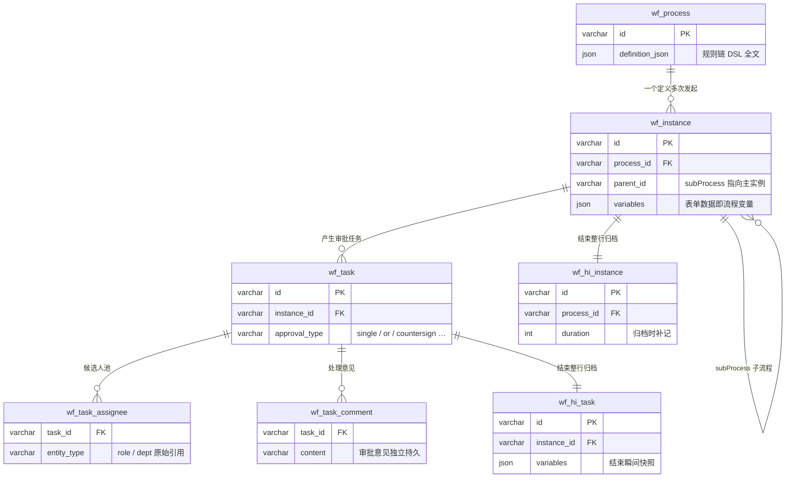

# 总览：为什么只有 7 张表

<div class="lead">
Activiti 全家桶动辄二三十张表，GFlow Engine 只有 7 张。少不是偷懒——是把「状态」和「结构」放对了地方。
</div>

## 建表清单

| 表 | 轨道 | 作用 |
|---|---|---|
| [wf_process](/guide/data-model/wf-process) | 定义 | 流程定义：DSL 全文 + 版本 |
| [wf_instance](/guide/data-model/wf-instance) | 运行时 | 进行中的流程实例 |
| [wf_task](/guide/data-model/wf-task) | 运行时 | 进行中的审批任务 |
| [wf_task_assignee](/guide/data-model/wf-task-assignee) | 运行时 | 任务候选人池（角色/部门原始引用） |
| [wf_task_comment](/guide/data-model/wf-task-comment) | 运行时 | 任务处理意见（审批评论持久化） |
| [wf_hi_instance](/guide/data-model/wf-hi-instance) | 历史 | 已结束实例归档 |
| [wf_hi_task](/guide/data-model/wf-hi-task) | 历史 | 已结束任务归档（含快照） |

<DataModelDiagram />

## 表间关系



## 为什么可以这么少

**1. 流程结构编码在 DSL 里，不在表里。**
节点间的先后、并行、条件关系就是规则链的 `connections`——引擎执行时在内存里走图，不需要「当前状态转移表」。执行到哪一步由活动任务行天然表达：**哪些 wf_task 行存在，流程就停在哪**。

**2. 会签/加签复用任务父子链。**
加签不是新表，是 `parent_id + sequence_order` 挂子任务；会签规则就存在任务行的 `approval_rule` JSON 里，没有独立的「会签配置表」。

**3. 候选人不冗余展开。**
`wf_task_assignee` 只存 `entity_type + entity_id` 原始引用（role:xxx / dept:xxx），查询待办时经 `IdentityService` 实时展开。组织架构改了，待办归属立即生效，不需要同步任务表。

**4. 表单数据即流程变量。**
发起表单的值装进 `wf_instance.variables`（JSON），任务结束瞬间快照进 `wf_hi_task.variables`。没有单独的「表单数据表」「字段值表」。

**5. 运行/历史双轨，而不是加标记位。**
进行中的行只保留办理所需的最小字段集，所以运行表永远小而热；结束后整行迁入 `wf_hi_*` 并补记 `duration` / `end_reason`。报表在历史表上随便加索引，不影响线上。

**6. 审批意见单独持久，不随任务搬家。**
一条意见一行，按 `task_id` 挂靠，落在 `wf_task_comment`。任务行完结迁入历史表后，意见原地可查、可追加——审批留痕是独立的时间线，不是任务行的附属字段。

## 引擎不建的表

用户、角色、部门、岗位等系统表**由宿主应用负责**（gflow 内置了完整的实现）。引擎通过 `IdentityService` 接口与之对接，天然适配你已有的组织架构。

## 初始化脚本

```bash
# 引擎仓库（PostgreSQL / MySQL）
createdb gflow
psql -d gflow -f gflow-engine/scripts/00.init_bpm_pg.sql
mysql -u root -p -e "CREATE DATABASE gflow"
mysql -u root -p gflow < gflow-engine/scripts/00.init_bpm_mysql.sql

# GFlow Platform（PostgreSQL：先引擎 7 张表，再宿主表 + 种子数据，两条都执行）
psql -d gflow -f gflow/scripts/engine/00.init_bpm_pg.sql
psql -d gflow -f gflow/scripts/00.init_pg.sql
```
