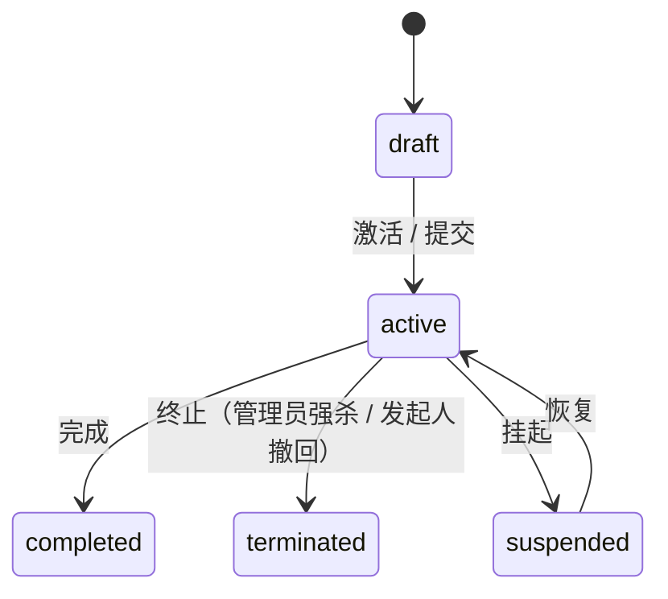

# wf_instance 运行时流程实例表

<div class="lead">
一次审批申请 = 一行。只存「进行中」的实例，结束后整行迁入 wf_hi_instance。
</div>

## 表结构

| 字段 | 类型 | 说明 |
|---|---|---|
| `id` | VARCHAR(36) PK | 实例 UUID |
| `process_id` | VARCHAR(36) | **流程定义版本行的 id**（锁版本运行） |
| `business_key` | VARCHAR(200) | 业务键（业务系统唯一编号，如报销单号） |
| `name` | VARCHAR(200) | 实例名称（如「王强的请假申请」） |
| `start_user_id` | VARCHAR(36) | 发起人用户 ID（系统触发时为空串） |
| `status` | VARCHAR(20) | `draft`（草稿，激活后转 `active`）/ `active` / `completed` / `suspended` / `terminated`（`cancelled` / `failed` 为枚举保留值，当前版本无写入路径） |
| `variables` | TEXT | **流程变量 JSON**——发起表单数据装在 `msg` 里，运行中可增改 |
| `current_activity` | VARCHAR(100) | 当前运行到的节点定义 ID |
| `priority` | INTEGER | 优先级（越大越优先，默认 50） |
| `parent_id` | VARCHAR(36) | 父实例 ID——**子流程回链主流程** |
| `tenant_id` | VARCHAR(100) | 租户 ID（SaaS 多租户） |
| `created_by / created_at / updated_by / updated_at` | — | 审计 |
| `end_reason` | VARCHAR(2000) | 完成/终止原因（含错误信息） |
| `duration` | BIGINT | 运行时长（毫秒） |
| `ended_at` | TIMESTAMPTZ | 结束时间 |

索引覆盖高频查询维度：`status`、`tenant_id`、`business_key`、`parent_id`、`created_at DESC`、`priority DESC, created_at ASC`（待办/抢单排序），以及组合索引 `(tenant_id, status, created_at DESC)`（管理端列表）与 `(tenant_id, start_user_id)`（我发起的）。

## variables：表单数据即流程变量

发起时的表单值整体装入 `variables`：

```json
{ "days": 5, "reason": "家中事务", "managerId": "mgr001" }
```

- 条件网关（`switch`）用 `msg.days` 这类表达式读取
- `userTask` 的候选人配置可经 `${msg.xxx}` 从变量解析（如发起人自选场景）
- AI/HTTP/自动化节点同样经 `${msg.xxx}` 取值

## 子流程

`subProcess` 节点会创建新实例，`parent_id` 指向主实例；子流程走完自己的 end 节点后，结果变量带回主流程继续执行。

## 生命周期



结束瞬间：行迁入 `wf_hi_instance`，补记 `duration` / `ended_at` / `end_reason`；发起人撤回时 `end_reason` 记「申请人撤回」。

::: tip 返回[数据模型总览](/guide/data-model/)
