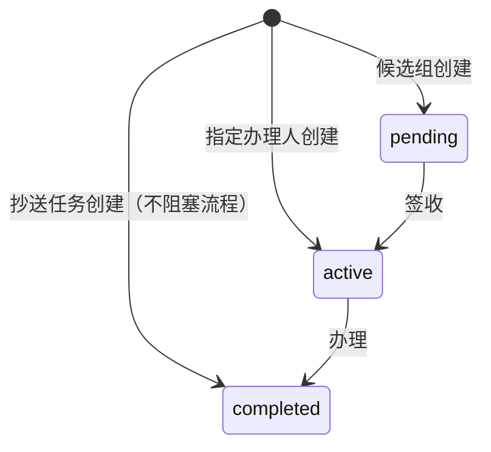

# wf_task 运行时任务表

<div class="lead">
一次「需要人来办的事」= 一行。或签、会签、加签、委托全部在这一张表上闭环——只保留进行中任务，只留办理所需的最小字段集。
</div>

## 表结构

### 标识与归属

| 字段 | 说明 |
|---|---|
| `id` | 任务 UUID |
| `process_instance_id` | 所属实例（**独立任务可为空**） |
| `process_id` | 流程定义版本 |
| `task_type` | 任务类型：列默认 `user_task`；运行时按产出节点写入 `userTask` 审批 / `ccTask` 抄送 / `delay` 延迟等节点类型 |
| `task_def_key` | 节点定义 ID（对应 DSL 里的 node id） |
| `name` / `description` | 任务名称与说明 |
| `tenant_id` + 审计四件套 | 租户隔离与审计（同其余 wf_* 表） |

### 状态机

| 字段 | 说明 |
|---|---|
| `status` | 全集：`created` / `assigned` / `waiting` / `pending` / `active` / `delegated` / `completed` / `returned` / `withdrawn` / `suspended` / `terminated`。初值按创建场景：指定办理人 → `active`；候选组模式 → `pending`（签收后 `active`）；抄送任务 → 直接 `completed` |
| `assignee` | 当前办理人 |
| `owner` | 拥有人（**委托前**的原办理人） |
| `claimed_at` | 签收时间（空 = 未签收，用于签收/抢单） |

### 会签与加签（核心）

| 字段 | 说明 |
|---|---|
| `parent_id` | **父任务 ID**——加签产生子任务挂到主任务下；会签每人一行 |
| `sequence_order` | 会签序号（顺序会签子任务按此排序；0 = 主任务或非会签） |
| `approval_type` | `single` 单人 / `or` 或签 / `sequential` 依次 / `vote` 票签 / `countersign` 会签 / `system` 系统 / `cc` 抄送；加签子任务继承父任务的 `approval_type` |
| `approval_rule` | 会签规则 JSON：`{"type":"all|any|majority|percent|count","value":阈值,"isSequential":bool}` |

### 办理与超时

| 字段 | 说明 |
|---|---|
| `form_key` | 关联表单 |
| `variables` | 任务级变量（运行时可改，如加签备注、转办留痕） |
| `due_date` | 截止时间（gflow 定时巡检 `due_date` 已超期的任务并发站内提醒） |
| `priority` | 优先级，待办排序用 |

### 委托与转办留痕

- **委托**：`delegate_from` / `delegate_reason` / `delegate_time` 三列直接落表
- **转办**：写入 `variables` 的 `transfer_from` / `transfer_reason` / `transfer_time`

### 结束字段

`ended_at` / `comment`（处理意见）/ `end_reason` / `duration`（耗时毫秒）。

## 状态一览



在途任务（active / pending）可挂起为 `suspended` 后恢复；被退回进入 `returned`；撤回进入 `withdrawn`；所属实例终止时连带作废为 `terminated`。

## 加签的存储形态

主管审批中加签「前置审批人 zhangwei」时：

```
wf_task: 主任务(parent_id=NULL, status=active)
wf_task: 子任务(parent_id=主任务, sequence_order=1, assignee=zhangwei)  ← 先审
```

引擎保证父任务在链上子任务全部完成前不出结果——这就是「加签」的全部存储实现，没有额外表。

## 索引设计

- `process_instance_id` —— 实例详情页取任务列表
- `assignee`、`status` —— 各自单列索引，我的待办按需组合
- `due_date` —— 超时扫描
- `priority DESC, created_at ASC` —— 待办排序
- `tenant_id`、`(process_instance_id, task_def_key, sequence_order)` —— 租户隔离与流程维度回溯
- `(parent_id, sequence_order)` —— 会签/加签链（部分索引，`parent_id IS NOT NULL`）

::: tip 返回[数据模型总览](/guide/data-model/)
