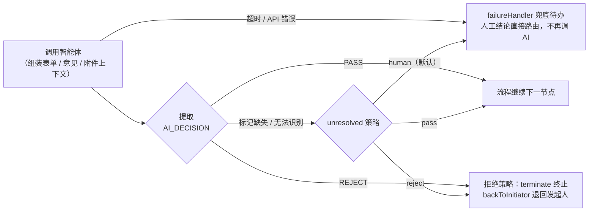

# 智能体（AI 审批）

<div class="lead">
商业版四大自研部件之一。aiAgent 节点把大模型接进审批流：低风险自动通过、高风险转人工、争议单据标注理由。模型、智能体、技能全程可视化配置。
</div>

## 典型用法

### 1. 风险预审

报销/采购单先过 AI 节点，模型根据表单字段与历史数据判断风险：

```
输入：msg.amount、msg.reason、msg.vendor …
输出：{ "risk": "low|mid|high", "reason": "…" }
```

AI 明确拒绝（REJECT）时按拒绝策略终止/退回；`low/mid/high` 等多级分流由下游条件分支读映射字段（如 `msg.aiRisk`）实现。

### 2. 智能填写辅助（规划中）

发起时 AI 根据一句话描述自动建议表单值、检查金额与事由的一致性（如「招待费 5 万元」触发大额预警）。

### 3. 审批意见摘要（规划中）

会签/多级审批后， AI 汇总各节点意见生成摘要，供终审人快速了解争议点。

## 节点配置

`aiAgent` 节点调用智能体规则链（基于 [rulego-components-ai](https://github.com/rulego/rulego-components-ai)）。节点本身不配置 LLM 与提示词——模型、systemPrompt、工具都在**智能体定义**里维护，节点只负责选定智能体、组装上下文、裁决路由输出：

```json
{
  "id": "node_ai_review",
  "type": "aiAgent",
  "name": "AI 预审",
  "configuration": {
    "agentId": "ai_expense_reviewer",
    "async": false,
    "timeoutSec": 120,
    "inputAssembly": {
      "customPrompt": "重点核查金额 ${msg.amount} 是否超出招待费标准",
      "contextSources": { "formData": true, "prevComments": true, "processInfo": true, "attachmentsImages": false }
    },
    "decision": { "rejectStrategy": "terminate", "unresolved": "human" },
    "failureHandler": ["u_finance_admin"],
    "outputMappings": [{ "from": "risk", "to": "aiRisk" }, { "from": "reason", "to": "aiReason" }],
    "flattenOutput": false
  }
}
```

### 裁决路由（decision）



配置 `decision` 即启用：节点自动在发给智能体的 user 消息末尾注入**裁决协议**，要求智能体在输出最后一行单独输出 `AI_DECISION: PASS` 或 `AI_DECISION: REJECT`，引擎用正则提取标记路由——**不依赖智能体输出是合法 JSON**，围栏、说明文字都不影响：

- `REJECT` → 拒绝策略：`terminate`（默认，终止实例）或 `backToInitiator`（退回发起人）
- `PASS` → 通过，流程继续下一节点
- 标记缺失/无法识别 → **未裁决策略**（`unresolved`）：
  - `human`（默认）：给 `failureHandler` 建审批待办，同意→继续下一节点，拒绝→按拒绝策略；未配兜底人则放行并在记录标记「AI未裁决」
  - `pass`：放行并标记
  - `reject`：按拒绝策略处理

无论哪种结局，metadata 写入 `aiDecision`（PASS/REJECT/UNRESOLVED/HUMAN_PASS/HUMAN_REJECT），审批详情可查——**不存在静默放行**。

### 人工兜底闭环

调用失败（超时/API 错误）与未裁决转人工共用同一份 `failureHandler` 名单。兜底人完成待办后，引擎重入节点时直接读取人工结论路由（同意→下一节点，拒绝→拒绝策略），**不会再次调用 AI**。

### 输出合并

固定三条规则，无歧义：

1. 完整输出**始终**写入 `msg._ai`（对象或原文）——审计原始记录永远在
2. `flattenOutput: true`（**缺省值**）时输出 JSON 顶层字段平铺进 `msg.Data`（**同名覆盖表单字段**，冲突字段用映射改名规避）；`false` 则隔离，完整响应只留在 `msg._ai`。该配置与 `httpCall` 节点语义和默认值一致
3. `outputMappings` 永远最后执行（显式配置优先级最高），如 `risk → aiRisk` 供后续条件分支用 `msg.aiRisk` 读取

### 附件识别（图片 / 文档）

`contextSources.attachments` 开启后，附件不只是一行文件名——服务端会把附件解析成模型可读的形态随消息发送：

- **图片**（png/jpg/jpeg/webp/gif/bmp）：以 OpenAI `image_url` 内容片直接随 user 消息发送。模型支持视觉（如 `glm-5.3-flash`、`kimi-k3`）就直接"看图"；不支持则自动降级为 `[图片：路径]` 文本，流程不报错。图片由服务端从存储读取（本地/OSS 均可），不依赖模型拉取相对地址
- **文档**（PDF/TXT/MD）：抽取文本（PDF 零依赖抽取，单文档截断 2 万字符）以 `## 文档：<文件名>` 章节并入正文；扫描件等无文本层的 PDF 抽不出内容时保持文件名清单
- 附件清单带状态标注（`发票.png（已附图）`、`合同.pdf（已附文本摘要）`），模型能把图片与文件名对应起来

细粒度开关（`attachmentsImages` / `attachmentsDocs`，缺省跟随附件主开关）：

```json
"contextSources": {
  "attachments": true,
  "attachmentsImages": false,
  "attachmentsDocs": true
}
```

上例：附件清单与文档摘要照发，但图片不送识别（比如流程固定用文本模型、想省 token 时）。设计器 AI 节点抽屉里对应「附件」主开关下的两个子开关。

护栏：单图超过 20MB、图片超过 8 张时跳过并在清单中保留文件名；单个附件解析失败只跳过该附件，不影响流程。

## gflow 中的体验

商业版内置完整的智能体管理（四大自研部件之一）：

- **智能体与技能管理**：每个智能体独立配置模型（provider/model/端点/API Key/温度等）、提示词模板、知识库技能与工具调用；模型供应商在「模型供应商」页维护（`llm_providers` 表，经 `GET /api/v1/llm/catalog` 获取可选模型目录），全局默认 LLM 连接在 `configs/config.yaml` 的 `llm.url / llm.api_key / llm.model`（或环境变量 `GFLOW_LLM_URL` / `GFLOW_LLM_API_KEY` / `GFLOW_LLM_MODEL`）
- **设计器集成**：流程里拖入「智能体」节点即可选择已配置的智能体；节点设置分四页——智能体 / 提示词 / AI 判定 / 异常处理
- **结果可追溯**：AI 判定结果与理由写入流程变量（`msg._ai` 或映射字段），审批详情的变量面板可查、可复核

## 工具与子智能体委派

智能体编辑对话框的「工具」页有两类可勾选工具：

- **内置工具**：skill（始终启用）、read / write / edit / bash（bash 支持黑/白名单与超时控制）
- **子智能体工具**：把其他智能体注册为可委派调用的工具。运行时主智能体按需把子任务转给子智能体——子智能体用自己的模型、提示词和工具完成后把结果返回，主智能体继续推理。保存为 `tools: [{ name, description, type: "agent", targetId: <目标智能体ID> }]`

子智能体委派的要点：

- **不能选择自己**（防自引用）；互相循环委派由引擎内置的死循环检测（同名同参重复调用告警）兜底，不硬熔断
- 目标智能体须在同租户下已存在；名称与描述会作为工具说明提供给主模型，描述写清楚"什么时候该委派"能显著提升委派质量
- 主智能体不需要强模型：把重活（看图、检索）委派出去，主模型只做编排与结论

### 典型场景：附件图片识别

aiAgent 节点开启附件上下文后，图片自动随消息发送——智能体配一个视觉模型（如 `glm-5.3-flash`，目录里带"视觉"徽标）即可直接识别附件图片，无需任何额外搭建。两种用法：

- **直连（推荐，零配置）**：智能体模型选带视觉能力的即可，图片直接进该模型的上下文
- **委派（省 token）**：主智能体用文本模型，通过子智能体工具委派给视觉子智能体看图——适合"主智能体做编排、少量图片才看"的场景，步骤见上文「工具与子智能体委派」

```json
{"messages":[{"role":"user","content":[
  {"type":"text","text":"识别这张发票"},
  {"type":"image_url","image_url":{"url":"<图片地址>"}}
]}]}
```

注意事项：

- 非视觉模型收到图片会自动降级为 `[图片：路径]` 文本，不会报错；也可用 `attachmentsImages:false` 显式不送图
- 大图以 base64 内联经主智能体转述可能损坏，委派链路传短地址/路径更可靠
- Office 二进制（docx/xlsx）与扫描件 PDF 暂不支持自动抽取（文字型 PDF/TXT/MD 支持）

## 模型供应商与模型目录

「系统设置 → 模型供应商」维护 LLM 连接（`llm_providers` 表），供应商保存后热更新引擎并重载规则链：

- **类型模板**：新建供应商可选预设（智谱、百炼、DeepSeek、Kimi 等）自动填充地址与模型清单；模型元数据（上下文/能力/思考档位）以模型目录（`catalog.json`）为权威来源，DB 已配置供应商经目录合并补齐
- **上下文窗口**支持人类可读写法：`1m`、`128k`、`8192` 均可（不带单位且小于 1000 按 k 理解，留空不限），列表与模型下拉显示紧凑格式（`1M` / `200K`）
- **模型能力徽标**：视觉 / 工具调用等能力驱动引擎门控——图片只发给带"视觉"能力的模型，其余自动降级文本
- 智谱目录按"只保留最新两代"维护（当前为 `glm-5.3` 文本旗舰与 `glm-5.3-flash` 原生多模态，均 1M 上下文）

## 边界与建议

- AI 判定**只做路由建议**，关键动作（实际打款等）仍应落在人工节点或自动化节点
- 智能体 systemPrompt 若写死了「只输出 JSON、不要任何其他文字」，请补一句「调用方要求输出裁决标记时遵照执行」，避免与注入的裁决协议冲突
- 提示词里只放必要字段，敏感信息脱敏后再送模型
- 自动通过只建议用于金额/风险有明确阈值的场景，其余输出给人工参考
