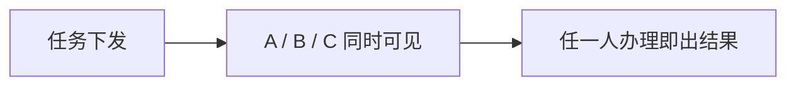
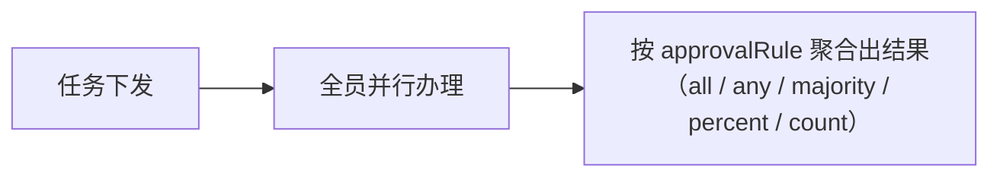
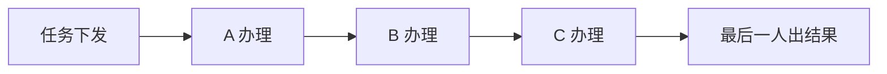

# 中国式审批语义

<div class="lead">
加签、驳回、会签、转办、撤回——这些让国外 BPMN 引擎头疼的本土语义，在 GFlow Engine 里是一等公民。全部动作在 <code>wf_task</code> 上闭环，经 REST API 与 Go API 暴露。
</div>

<script setup>
const matrixGroups = [
  {
    title: '审批方式',
    items: ['单人审批', '或签（任一通过）', '并行会签', '顺序会签', '依次审批', '票签（比例/票数）', '系统任务', '抄送'],
  },
  {
    title: '会签聚合规则',
    items: ['全票 all（一票否决）', '任一 any', '多数 majority', '百分比 percent', '固定票数 count', '顺序/并行可配'],
  },
  {
    title: '办理中动作',
    items: ['加签', '减签', '转办', '委派', '签收/抢单', '退回上一节点', '撤回', '评论', '附件'],
  },
  {
    title: '候选人类型',
    items: ['指定成员', '角色', '部门', '直属主管', '多级主管', '发起人自选', '发起人本人'],
  },
  {
    title: '实例级操作',
    items: ['挂起', '恢复', '终止', '撤回申请', '超时催办', '优先级', '流程跟踪'],
  },
  {
    title: '自审策略（审批人=发起人）',
    items: ['跳过', '转直属主管', '转部门主管', '允许自审'],
  },
]
</script>

<CheckMatrix :groups="matrixGroups" />

## 审批方式（approvalType）

节点 `configuration.approvalType` 取值（`wf_task.approval_type` 同值落库）：

| approvalType | 通过规则 | 说明 |
|---|---|---|
| `single` 单人 | 办理人处理即出结果 | 默认值；assignee 为单个办理人 |
| `or` 或签 | **任一人通过即过**，一票拒绝即驳 | 多候选人同时收到，先办先得 |
| `countersign` 会签 | 按 `approvalRule` 聚合（全票/多数/比例/票数） | 配合规则字段，见下表 |
| `sequential` 依次 | 前一人办理完，下一人才收到任务 | 引擎按需逐个创建单人任务，前一人不出结果后一人不可见 |
| `vote` 票签 | 按 `approvalRule` 的比例/票数出结果 | 与会签共用规则结构，适合评审表决场景 |
| `system` 系统 | 无人工投票 | 自动节点内部使用 |
| `cc` 抄送 | 不产生审批结果 | `ccTask` 节点专用 |

三种多人方式的任务流转差异：

**或签 or** —— 多人同时可见，先办先得：



**会签 countersign / 票签 vote** —— 全员并行办理，按规则聚合：



**依次审批 sequential** —— 串行逐人办理，前一人不出结果后一人不可见：



## 会签规则（approvalRule）

会签/票签的聚合规则写在 `approval_rule`（JSON 字符串），结构体为 `CountersignRule`：

| 字段 | 类型 | 说明 |
|---|---|---|
| `type` | string | 聚合方式：`all` / `any` / `majority` / `percent` / `count` |
| `value` | float | 规则值，`percent` 和 `count` 类型使用 |
| `isSequential` | bool | `false` 并行会签（默认）/ `true` 顺序会签 |

`type` 聚合方式明细（典型 JSON 组合见下文）：

| type | 通过条件 | 拒绝条件 |
|---|---|---|
| `all` | 全员通过 | 一票拒绝即驳 |
| `any` | 任一人通过 | 任一拒绝即驳，以先完成者为准 |
| `majority` | 多数通过（`total/2+1`） | 多数拒绝 |
| `percent` | 通过票占比 ≥ `value`（向上取整：3 人 60% 需 2 票） | 剩余票不可能达标即驳 |
| `count` | 通过票数 ≥ `value` | 剩余票不可能达标即驳 |

典型组合：

```json
// 并行会签 · 全票通过（一票否决）
{ "type": "all", "isSequential": false }

// 顺序会签 · 多数通过（逐个审，过半出结果）
{ "type": "majority", "isSequential": true }

// 并行票签 · 60% 通过（评审表决）
{ "type": "percent", "value": 60 }
```

> `isSequential: true` 时按 `wf_task.sequence_order` 逐人激活；并行时全员同时可见，先签收先办（见下文签收/抢单）。

## 审批人含发起人时（自审策略）

审批链路中出现发起人本人时，按节点配置的 `selfApprovalType` 处理，不会出现「自己审自己」：

| selfApprovalType | 行为 |
|---|---|
| `skip` | 跳过该审批人，直接到下一节点 |
| `delegate_to_manager` | 转给直属主管（主管缺失时顺延部门主管，再兜底 `candidateConfig` 变量指定人） |
| `delegate_to_department_manager` | 转给部门主管审批 |
| `allow` | 允许发起人自审（默认值，需合规要求时使用） |

> 枚举中另有 `auto_approve`（自动通过）为预留值，当前实现等价于 `allow`。

## 候选人解析

任务按以下 `candidateType` 发起，候选人池（`wf_task_assignee`）只存原始引用，查询时经 `IdentityService` 展开：

| candidateType | 解析方式 |
|---|---|
| `user` | `candidateUsers` 直接给用户 ID |
| `role` / `dept` | 按角色/部门查用户（可配部门主管审批） |
| `direct_manager` | 发起人的直属主管 |
| `multi_level_manager` | 发起人的多级主管 |
| `initiator_select` | 发起人提交时自选审批人 |
| `initiator_self` | 发起人本人（自审场景） |

## 办理中的动作

### 加签 / 减签

审批中途动态插入审批人（加签）或移除未办理的加签人/会签人（减签）。加签为**前加签**语义：新加签人先审，加签子任务全部完成后原审批人再出结果。引擎通过 `wf_task.parent_id + sequence_order` 维护任务父子链，加签产生子任务，主任务等待链上任务全部完成。

减签只作用于**未办理**的子任务：已出结果的审批人不可移除。会签 / 票签节点减签后按 `approvalRule` 重算剩余票——已满足阈值则直接出结果流转；全部移除（无人能审）时终止实例。减签经 `ReduceSign` 事件留痕（审计 / 通知用）。

### 退回

可退回到**上一个已办审批节点**重新办理：

- 退回目标固定为最近一个已办 `userTask`（不能跨节点挑目标，也不能直接退发起人）
- 被退回任务归档为 `returned`，目标节点任务重建，表单数据与变量随行带回
- 需要「退回发起人」时，给节点配置驳回策略 `rejectStrategy: rejectToStarter`

### 转办 / 委派

两个动作都把任务交给别人，差别在**最终由谁出结果**（面向用户的操作说明见[审批动作指南](/guide/features/approval-actions)）：

- **转办**：任务转给他人办理，办理人变更，原审批人出局，新办理人审批即流转。留痕写入任务变量 `transfer_from` / `transfer_reason` / `transfer_time`
- **委派**：受托人先行把关，`owner` 保留原拥有人、`delegate_from` 落表留痕。被委派人通过 / 拒绝后任务**不流转**，自动归还原审批人并通知（`TaskEventResolved`），审批意见保留在时间线；原审批人再审一次才出结果。委派禁止指派给自己

### 签收 / 抢单

角色/部门候选任务先到先签：候选池中任何人可签收（`claimed_at` 记录时间），签收后其他人不可再办。

### 撤回

发起人可**撤回**在途申请：实例终止（状态 `terminated`，`end_reason` 记「申请人撤回」），在途任务作废，之后可修改表单重新发起。

## 实例级操作

| 操作 | 实例状态 | 说明 |
|---|---|---|
| 挂起 / 恢复 | `suspended` → `active` | 暂停全部未办任务，恢复时单节点恢复不丢父上下文 |
| 终止 | `terminated` | 管理员强杀，记录 `end_reason` |
| 完成 | `completed` | 正常走完 end 节点，归档入历史表 |

## 超时策略

节点的 `timeoutPolicy`（`dueInMinutes` 截止时长 + `action` 动作）决定逾期处理方式，gflow 每 30 分钟定时巡检 `wf_task.due_date` 已超期的在途任务：

- `remind`（默认）：经内置通知中心发站内提醒，不改变任务状态
- `autoApprove`：以系统身份自动通过逾期任务，流程继续
- `autoReject`：以系统身份自动拒绝，按节点驳回策略流转

`due_date` 也可经 `TaskService.SetDueDate` Go API 手工设置。多实例节点（顺序会签/依次审批）的每个后续子任务按**各自创建时刻**重新求值 `dueInMinutes`，避免整条链共用同一个静态截止时间。直接嵌引擎（无 gflow 平台）时，巡检逻辑需宿主自行实现（参考 gflow 的逾期扫描器）。

## 抄送

`ccTask` 节点生成抄送记录（不阻塞流程），经 `CCTaskCreatedListener` 回调；gflow 前端有「抄送我」列表，抄送人可评论。

## 动作权限

每个 `userTask` 可在 `additionalInfo.actionPermissions` 里精细开关审批人可用的动作。**通过（approve）/驳回（reject）由后端强制开放，不可关闭**；其余动作默认关闭，需显式开启：

```json
{
  "transfer": true,
  "return": true,
  "delegate": true,
  "addSign": true,
  "reduceSign": true,
  "urge": true,
  "uploadAttachment": true
}
```

发起人侧另有 `suspend` / `withdraw` / `terminate` / `resubmit` 等实例级开关。设计器里逐节点可视化配置。
