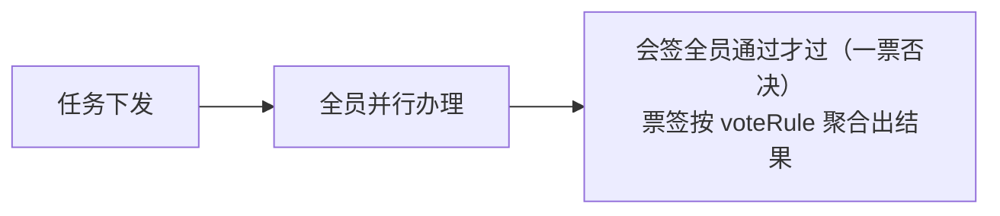

# 中国式审批语义

<div class="lead">
加签、驳回、会签、转办、撤回——这些让国外 BPMN 引擎头疼的本土语义，在 GFlow Engine 里是一等公民。全部动作在 <code>wf_task</code> 上闭环，经 REST API 与 Go API 暴露。
</div>

<script setup>
const matrixGroups = [
  {
    title: '审批方式',
    items: ['单人审批 single', '或签 any（任一通过）', '会签 all（一票否决）', '顺序审批 sequential', '票签 vote（比例/票数）', '系统任务', '抄送'],
  },
  {
    title: '票签阈值',
    items: ['过半 majority（缺省）', '百分比 percent', '固定票数 count'],
  },
  {
    title: '办理中动作',
    items: ['加签', '减签', '转办', '委派', '签收/抢单', '退回上一节点', '撤回', '评论', '附件'],
  },
  {
    title: '审批人类型',
    items: ['指定成员', '角色', '部门', '直属主管', '多级主管', '发起人自选', '发起人本人'],
  },
  {
    title: '实例级操作',
    items: ['挂起', '恢复', '终止', '撤回申请', '超时催办', '优先级', '流程跟踪'],
  },
  {
    title: '自审策略（审批人=发起人）',
    items: ['不过滤 none（缺省）', '移除发起人 skip', '保留发起人 autoApprove', '转直属主管', '转部门主管'],
  },
]
</script>

<CheckMatrix :groups="matrixGroups" />

## 审批方式（approveMode）

节点 `configuration.approveMode` 取值（`wf_task.approval_type` 同值落库），枚举为大小写敏感的精确取值：

| approveMode | 通过规则 | 说明 |
|---|---|---|
| `single` 单人 | 办理人处理即出结果 | 缺省值；assignee 为单个办理人 |
| `any` 或签 | **任一人通过即过**，一票拒绝即驳 | 多候选人同时收到，先办先得 |
| `all` 会签 | 全员通过，一票否决 | 全员并行办理，人人出结果 |
| `sequential` 顺序审批 | 前一人办理完，下一人才收到任务 | 引擎按需逐个创建单人任务，前一人不出结果后一人不可见 |
| `vote` 票签 | 按 `voteRule` 阈值出结果 | 全员并行表决，适合评审表决场景，见下表 |

`system` / `cc` 为引擎内部使用的审批类型（系统自动任务与抄送任务），`userTask` 节点不接受这两个配置值。

三种多人方式的任务流转差异：

**或签 any** —— 多人同时可见，先办先得：


**会签 all / 票签 vote** —— 全员并行办理，出齐后聚合：



**顺序审批 sequential** —— 串行逐人办理，前一人不出结果后一人不可见：


## 票签阈值（voteRule）

`approveMode: vote` 时的通过阈值写在 `configuration.voteRule`，落库到 `wf_task.approval_rule`（JSON）：

| 字段 | 类型 | 说明 |
|---|---|---|
| `type` | string | 阈值类型：`majority` / `percent` / `count` |
| `value` | float | 规则值：`percent` 取 0~100；`count` 为票数；`majority` 不消费 |

`type` 阈值明细（未配 `voteRule` 时缺省按 `majority`）：

| type | 通过条件 | 拒绝条件 |
|---|---|---|
| `majority` | 过半通过（`total/2+1`） | 多数拒绝 |
| `percent` | 通过票占比 ≥ `value`（向上取整：3 人 60% 需 2 票） | 剩余票不可能达标即驳 |
| `count` | 通过票数 ≥ `value` | 剩余票不可能达标即驳 |

典型组合：

```json
// 票签 · 过半通过（缺省，可省略 voteRule）
{ "type": "majority" }

// 票签 · 60% 通过（评审表决）
{ "type": "percent", "value": 60 }

// 票签 · 至少 3 票通过
{ "type": "count", "value": 3 }
```

> `vote` 为全员并行表决，先签收先办（见下文签收/抢单）；需要逐个办理时用 `approveMode: sequential`。

## 审批人含发起人时（自审策略）

审批链路中出现发起人本人时，按节点配置的 `selfApproval` 处理：

| selfApproval | 行为 |
|---|---|
| `none` | 缺省，不过滤，发起人照常出现在审批人中 |
| `skip` | 移除发起人，直接到下一节点（`initiatorSelf` 审批人配 `skip` 会无人可审，部署期校验拒绝） |
| `autoApprove` | 发起人的任务创建即由系统按通过办结，审批记录注明「发起人自动通过」；或签场景下发起人的票计入或签判定（候选池认领型任务不受影响，认领后正常审批） |
| `delegateToManager` | 发起人的任务转交其直接上级 |
| `delegateToDeptManager` | 发起人的任务转交部门负责人 |

## 审批人解析

任务按节点 `configuration.approver` 的 `type` 发起，候选人池（`wf_task_assignee`）只存原始引用，查询时经 `IdentityService` 展开：

| approver.type | 解析方式 |
|---|---|
| `user` | `userIds` 直接给用户 ID |
| `role` / `dept` | 按角色/部门查用户，产生待认领任务 |
| `manager` | 发起人的第 `levels` 级主管（默认 1 级） |
| `multiLevelManager` | 发起人的多级主管：`levels > 0` 固定审批到第 N 级，`levels < 0` 直到最上层 |
| `initiatorSelect` | 发起人提交时自选：`expression` 表达式模板（如 `${msg.selectedUsers}`）从流程变量解析审批人 |
| `initiatorSelf` | 发起人本人（自审场景） |

## 办理中的动作

### 加签 / 减签

审批中途动态插入审批人（加签）或移除未办理的加签人/会签人（减签）。加签为**前加签**语义：新加签人先审，加签子任务全部完成后原审批人再出结果。引擎通过 `wf_task.parent_id + sequence_order` 维护任务父子链，加签产生子任务，主任务等待链上任务全部完成。

减签只作用于**未办理**的子任务：已出结果的审批人不可移除。会签 / 票签节点减签后按剩余票重算——已满足阈值则直接出结果流转；全部移除（无人能审）时终止实例。减签经 `ReduceSign` 事件留痕（审计 / 通知用）。

### 退回

可退回到**上一个已办审批节点**重新办理：

- 退回目标固定为最近一个已办 `userTask`（不能跨节点挑目标，也不能直接退发起人）
- 被退回任务归档为 `returned`，目标节点任务重建，表单数据与变量随行带回
- 需要「退回发起人」时，给节点配驳回 `reject.strategy: toStarter`

### 转办 / 委派

两个动作都把任务交给别人，差别在**最终由谁出结果**（面向用户的操作说明见[审批动作指南](/guide/features/approval-actions)）：

- **转办**：任务转给他人办理，办理人变更，原审批人出局，新办理人审批即流转。留痕写入任务变量 `transfer_from` / `transfer_reason` / `transfer_time`
- **委派**：受托人先行把关，`owner` 保留原拥有人、`delegate_from` 落表留痕。被委派人通过 / 拒绝后任务**不流转**，自动归还原审批人并通知（`TaskEventResolved`），审批意见保留在时间线；原审批人再审一次才出结果。委派禁止指派给自己

### 签收 / 抢单

角色/部门候选任务先到先签：候选池中任何人可签收（`claimed_at` 记录时间），签收后其他人不可再办。

### 撤回

发起人可**撤回**在途申请：实例终止（状态 `terminated`，`end_reason` 记「申请人撤回」），在途任务作废，之后可修改表单重新发起。

## 实例级操作

| 操作 | 实例状态 | 说明 |
|---|---|---|
| 挂起 / 恢复 | `suspended` → `active` | 暂停全部未办任务，恢复时单节点恢复不丢父上下文 |
| 终止 | `terminated` | 管理员强杀，记录 `end_reason` |
| 完成 | `completed` | 正常走完 end 节点，归档入历史表 |

**后续审批节点预测（`upcoming`）**：活态实例的详情响应带 `upcoming` 字段——从活跃节点沿 Success 出边向前遍历，预测后续审批节点（`nodeId` / `nodeName` / `approverType` / `assignees` / `unresolved`）。预测非承诺：转办、加签都可能改变实际走向；条件分支处截断，发起人自选在变量未落定时 `unresolved` 为 `initiatorSelect`。

## 超时（timeout）

节点的 `configuration.timeout`（`dueInMinutes` 截止时长 + `action` 动作）决定逾期处理方式，时长**相对每个任务创建时刻**计算，由宿主的逾期巡检执行（gflow 平台每 30 分钟定时扫描 `wf_task.due_date` 已超期的在途任务）：

- `remind`（默认）：经内置通知中心发站内提醒，不改变任务状态
- `autoApprove`：以系统身份自动通过逾期任务，流程继续
- `autoReject`：以系统身份自动拒绝，按节点驳回配置流转

`due_date` 也可经 `TaskService.SetDueDate` Go API 手工设置。多实例节点（顺序审批）的每个后续子任务按**各自创建时刻**重新求值 `dueInMinutes`，避免整条链共用同一个静态截止时间。直接嵌引擎（无 gflow 平台）时，巡检逻辑需宿主自行实现（参考 gflow 的逾期扫描器）。

## 驳回（reject）

节点的 `configuration.reject` 决定审批拒绝后流程的去向：

```json
{ "strategy": "toNode", "target": "node_supplement" }
```

| strategy | 行为 |
|---|---|
| `terminate` | 终止实例（缺省） |
| `toStarter` | 跳回开始节点（退回发起人改材料重提） |
| `toPrev` | 跳到上一个 `userTask` 节点重办 |
| `toNode` | 跳到 `target` 指定节点（必填，须为链中存在的节点 ID，且必须是当前节点的上游节点；回退路径穿过 fork/join 的跨并行分支回退不支持，部署期拒绝） |

跳转目标不可达（条件不满足、边不存在等）时，按节点的 Reject / Failure 出边兜底；连出边都没有则终止实例。多个审批人模式下任一人拒绝即触发驳回（或签先到先得，会签一票否决）。

## 抄送

`ccTask` 节点生成抄送记录（不阻塞流程），经 `CCTaskCreatedListener` 回调；gflow 前端有「抄送我」列表，抄送人可评论。

## 动作权限

每个 `userTask` 可在 `additionalInfo.actionPermissions` 里精细开关审批人可用的动作。**通过（approve）/驳回（reject）由后端强制开放，不可关闭**；其余动作默认关闭，需显式开启：

```json
{
  "transfer": true,
  "return": true,
  "delegate": true,
  "addSign": true,
  "reduceSign": true,
  "urge": true,
  "uploadAttachment": true
}
```

发起人侧另有 `suspend` / `withdraw` / `terminate` / `resubmit` 等实例级开关。设计器里逐节点可视化配置。

## 部署期校验

部署 / 更新流程时，引擎对各节点 `configuration` 做校验：未知取值、必填缺失、互斥组合（如票签阈值配在非票签节点、`toNode` 缺 `target`、驳回目标非上游节点或跨并行分支）会**直接拒绝部署**，并给出节点级错误信息——配置错误拦在写入前而不是运行期。
