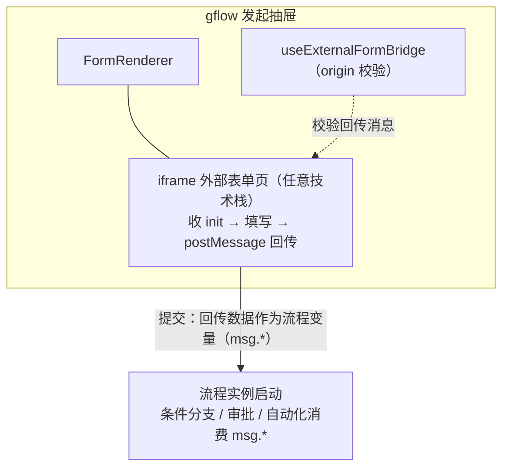
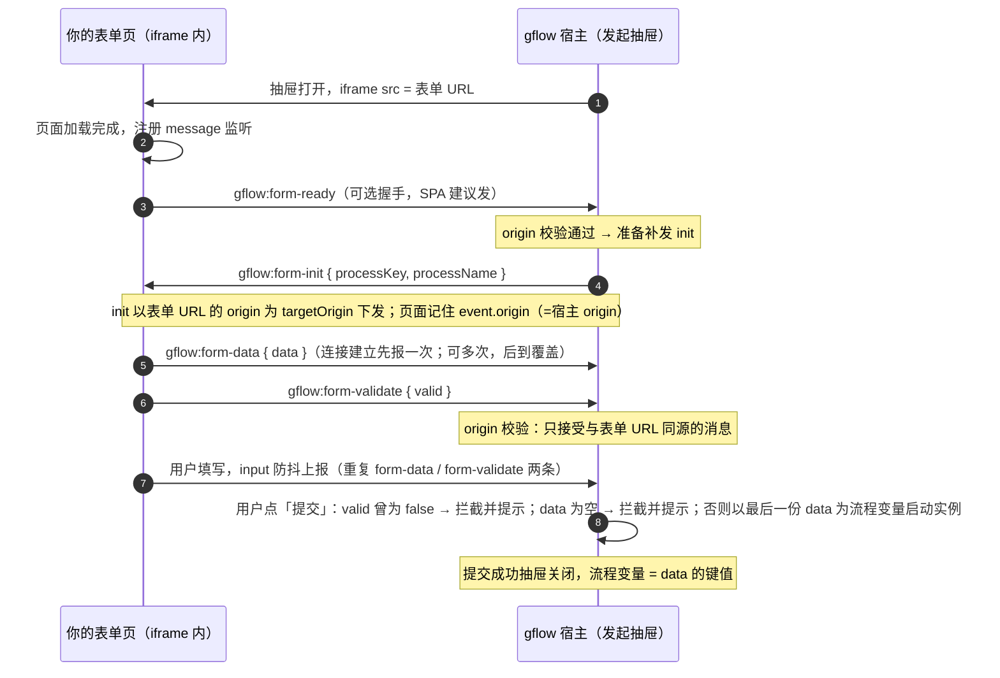

# 外部表单

<div class="lead">
表单不在 gflow 里画，而是指向你自己系统里已有的页面：发起时以 iframe 嵌入填写，数据通过 postMessage 协议回传成流程变量；审批时以只读数据表回显。引擎只管流程，不抢你的表单。
</div>

## 适用场景

| 场景 | 为什么选外部表单 |
| --- | --- |
| 已有业务系统（ERP/CRM/OA）的表单要接审批 | 表单继续留在原系统维护，gflow 只挂流程，不重复开发 |
| 表单交互复杂（依赖原系统的接口、组件、级联数据） | 外部页面想怎么写就怎么写，gflow 不感知内部实现 |
| 表单需要复用原系统的登录态、权限、数据校验 | iframe 内与原系统同源，原有能力全部可用 |
| 跨系统数据回流 | 提交后数据进入流程变量，可驱动条件分支与自动化节点 |

不适合的场景：全新的、简单的审批单——用[表单设计器](/guide/features/form-engine)拖拽画一个更省事，还能享受字段权限、公式、审批回显等内置能力。

## 工作原理



- **发起视角**：iframe 加载外部页，gflow 向它发送 `gflow:form-init` 初始化上下文；用户填写后外部页通过 `postMessage` 回传数据与校验结果。
- **提交**：回传的数据整体作为流程变量写入实例（字段名即变量名，条件分支里用 `msg.amount` 这样的表达式消费）。
- **审批视角**：外部表单**恒只读**——外部页面没有回显/编辑协议，gflow 用已提交的变量渲染一张只读数据表，保证审批人可见；不支持字段权限配置。

## 接入步骤

### 第 1 步：在「表单管理」创建外部表单模板

系统管理 → 表单模板 → 添加表单：

- **表单类型**：选「外部表单」
- **PC 端 URL**：你的表单页面地址（必填，须以 `http(s)://` 开头，或以 `/` 开头的同站路径）
- 表单编码（code）记一下，流程要引用它

> 页面还没写？先把第 3 步的最小示例部署上去占位——模板 URL 改动对已发布流程即时生效，随时可换真实地址。

### 第 2 步：流程设计器挂接模板

流程设计 → 第 2 步切到「**表单模板**」→ 从模板库选择刚才创建的外部表单 → 完成流程设计 → 发布。

流程 DSL 里只存引用（`formKey`），不内联 URL：

```json
{
  "ruleChain": {
    "additionalInfo": {
      "formType": "external",
      "formKey": "my_external_form",
      "formUrl": null
    }
  }
}
```

> 模板在「表单模板」页集中维护：改 URL、换地址对已发布流程**即时生效**（发起时实时解析）；被生效流程引用的模板不可删除。

### 第 3 步：实现外部表单页（postMessage 协议）

协议一共 4 条消息，前缀统一为 `gflow:form-`：

| 方向 | 消息 | 载荷 | 说明 |
| --- | --- | --- | --- |
| 页面 → gflow | `gflow:form-ready` | 无 | 页面加载完成后主动上报，宿主收到会立即补发 init；此时页面还不知道宿主 origin，`targetOrigin` 用 `'*'` 是安全的（消息不带任何数据，宿主侧仍会校验页面 origin） |
| gflow → 页面 | `gflow:form-init` | `{ processKey, processName }` | iframe 加载完成时下发，可按 processKey 定制展示；收到 ready 也会补发；页面内部跳转/刷新会重发 |
| 页面 → gflow | `gflow:form-data` | `{ data: {...} }` | 用户填写后上报，**可多次上报（后到覆盖）**；提交时以最后一份为准 |
| 页面 → gflow | `gflow:form-validate` | `{ valid: boolean }` | 上报过 `valid: false` 会被提交动作拦截；从未上报则不拦截 |

`ready` 是可选的握手消息：静态页可省略（宿主在 iframe load 时已下发 init）；**单页应用（Vue/React 等）建议上报**——异步挂载可能错过 load 时的一次性 init。

最小可用实现（原生 HTML/JS，任何框架同理）：

```html
<!DOCTYPE html>
<html>
<body>
  <form onsubmit="return false">
    <label>报销金额 <input id="amount"></label>
    <label>事由 <input id="reason"></label>
  </form>
  <button onclick="report()">提交本页数据</button>

  <script>
    var hostOrigin = null
    // 0) 页面就绪即上报 ready（可选握手，SPA 建议发）：宿主收到会立即补发 init
    window.parent.postMessage({ type: 'gflow:form-ready' }, '*')
    // 1) 收到 gflow 初始化消息：记住宿主 origin，可按 processKey 定制展示
    window.addEventListener('message', function (event) {
      if (!event.data || event.data.type !== 'gflow:form-init') return
      hostOrigin = event.origin
      console.log('gflow 流程：', event.data.processName)
    })

    // 2) 上报表单数据：data 的键就是流程变量名（条件分支里 msg.amount 消费）
    //    targetOrigin 必须回填宿主 origin，不要用 '*'
    function report() {
      if (!hostOrigin) return
      window.parent.postMessage({
        type: 'gflow:form-data',
        data: {
          amount: Number(document.getElementById('amount').value),
          reason: document.getElementById('reason').value
        }
      }, hostOrigin)
      window.parent.postMessage({ type: 'gflow:form-validate', valid: true }, hostOrigin)
    }
  </script>
</body>
</html>
```

推荐在用户输入时**实时上报**（`input` 事件触发 `report`），体验最好，也避免用户忘了点页面内按钮。

### 第 4 步：发起与审批

- 发起人在发起申请页打开该流程 → 抽屉里渲染你的外部页面 → 填写 → 点抽屉底部「提交」。
- 提交校验规则：回传过 `valid: false` → 拦截并提示；从未回传数据（`form-data` 为空）→ 拦截并提示；只回传数据未回传校验结果 → 放行。
- 审批人在待办详情看到的是**只读数据表**（键值对），不是 iframe。

## 对接端交互时序

把 gflow 宿主（发起抽屉）与你的表单页各自要做的事按时间轴对齐：



对接端清单（照抄即接入）：

1. **注册监听**：页面加载即 `window.addEventListener('message', handler)`；只响应 `type === 'gflow:form-init'`，其余消息忽略。
2. **上报 ready（可选握手）**：页面就绪即 `window.parent.postMessage({ type: 'gflow:form-ready' }, '*')`，宿主收到会立即补发 init。不带数据所以 `'*'` 是安全的；静态页可省略，**SPA 强烈建议**。
3. **捕获宿主 origin**：从 init 事件的 `event.origin` 记下宿主地址，后续所有回传的 `targetOrigin` 都用它，**绝不用 `'*'`**。
4. **边填边传**：`input` 事件防抖 300ms 上报 `gflow:form-data`；连接建立（收到 init）时先报一次初始值。宿主提交永远取最后一份。
5. **上报校验**：每次上报数据的同时报 `gflow:form-validate`；`valid: false` 会拦截宿主提交（提示在宿主侧，具体字段错误由你的页面自己渲染）。
6. **页内跳转要重新接**：iframe 内部导航/刷新会重新触发 load，宿主会**重发 init**——新页面必须重新注册监听（单页应用内路由切换不受影响）。
7. **未嵌入兜底**：一段时间收不到 init（页面被直接打开），提示“请在 gflow 发起抽屉中打开”，禁用相关逻辑即可。

完整可运行的参考实现见 gflow 仓库 `docs/demo/external_form_demo.html`（线上演示环境的
[/gflow/demo/external-form.html](http://8.134.32.225:8081/gflow/demo/external-form.html)
即此文件，配合 `docs/demo/external_form_request.json` 导入的 `demo_external_form` 流程可直接体验整条链路）。

## 安全规则

- **origin 双向校验**：gflow 只接受「与表单 URL 同源」的 postMessage；你的页面回传时也必须把 `targetOrigin` 写成宿主 origin（即 `event.origin`），不要图省事用 `'*'`。
- 表单 URL 解析不出 origin（相对路径等）时，gflow 退化为只接受宿主同源消息。
- 外部页面务必自校验：`gflow:form-init` 之外的消息不要响应；回传前完成自身业务校验（`valid: false` 只做拦截提示，不做具体字段报错）。
- 若外部页面不需要同源 cookie，建议部署时给页面响应头加 `X-Frame-Options`/CSP `frame-ancestors` 限定只允许被 gflow 域名嵌入。

## 常见问题

**Q：审批人能编辑外部表单吗？**
不能。外部表单没有编辑回传协议，审批视角恒只读（数据表回显）。需要审批人改字段的流程请用表单设计器 + 字段权限。

**Q：字段名有什么讲究？**
`form-data` 里 `data` 对象的键就是流程变量名，直接进入 `msg`：条件分支写 `msg.amount > 1000`、自动化节点引用 `msg.reason`。建议用英文驼峰命名，中文键在表达式里写起来麻烦。

**Q：APP 端 URL 是干嘛的？**
表单模板上预留的移动端地址字段，当前 Web 端只消费 PC 端 URL；移动端接入时用它。

**Q：能不建模板、直接在 DSL 里写死 URL 吗？**
可以。API 部署的 DSL 把 `formUrl` 直接写成绝对地址即可（`formKey` 留空）。但推荐走模板：URL 集中管理、改一处全部生效。

**Q：外部页面收不到 `gflow:form-init`？**
依次检查：表单模板的 PC 端 URL 是否正确；页面是否监听了 `window` 的 `message` 事件；页面是否部署在与 URL 一致的 origin 上（iframe 内跳转到别的域后，init 会发给新页面，需重新监听）。单页应用（Vue/React 等）异步挂载可能错过 load 时下发的 init，请在页面就绪时上报一次 `gflow:form-ready`，宿主会立即补发。

**Q：iframe 里页面白屏 / 拒绝连接？**
最常见原因：你的页面（或其前置网关）带了 `X-Frame-Options: DENY / SAMEORIGIN`，或 CSP `frame-ancestors` 白名单里没有 gflow 域名，浏览器直接拒绝渲染。排查：DevTools Console 看是否有 "Refused to display … in a frame" 报错；解决：去掉该响应头，或把 gflow 域名加进 `frame-ancestors` 白名单。

**Q：iframe 里我的页面丢失登录态 / 跳到登录页？**
跨站 iframe 默认不携带第三方 Cookie（浏览器 SameSite=Lax 语义）。按优先级：把表单页部署为 gflow 同站路径（URL 以 `/` 开头，同源共享 Cookie）；或给表单页域名的 Cookie 设 `SameSite=None; Secure`；或页面改用 URL 参数 token 等不依赖 Cookie 的鉴权。

**Q：审批详情里字段名能显示中文吗？**
只读数据表原样展示 `data` 的键值，没有键名到中文标签的映射。要审批人看得舒服：字段命名兼顾可读性，或直接用中文键（表达式引用与维护稍麻烦，建议评估后取舍）。

**Q：提交时报「外部表单尚未提交数据」？**
说明 gflow 没收到过你的 `form-data`：最常见原因是回传时 `targetOrigin` 写错（写成 `'*'`，或写成了页面自己的 origin），或页面与表单模板 URL 不同源导致被 gflow 的 origin 校验拒绝。
