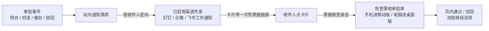

# IM 工作通知与免登审批

<div class="lead">
审批不用追着人问。待办、抄送、催办实时推送到钉钉、企业微信、飞书的工作通知，点卡片免登录直达审批单——手机上点开就能批，批完流程自动往下走。
</div>

## 解决什么问题

审批系统最常见的死法不是功能不够，是**审批停在系统里、人不在系统里**：待办躺在列表页没人看，流程卡在某个领导手里一整天，财务催、发起人等，最后靠微信截图人肉传话。

| 常见做法的坑 | GFlow 的做法 |
| --- | --- |
| 待办只在系统里，不打开就不知道有单要批 | 审批事件实时外发为**工作通知**，直达收件人本人的钉钉 / 企微 / 飞书 |
| 点了通知还要输一遍账号密码，手机上更折腾 | 卡片里的链接**免登录直达单据**，钉钉 / 企微容器内静默免登，进去就能批 |
| 用群机器人广播审批链接，链接进了群——谁先点谁批，出了事查不到人 | 消息**定向到人**，只有收件人收到；链接绑一次性票据，转发无效，审批动作全部落系统内、全程审计 |
| IM 账号和系统账号是两套，绑定关系靠手工维护 | **通讯录同步**自动拉组织架构，按手机号自动绑定；离职自动禁用，补齐手机号重跑即补绑 |
| 钉钉 / 企微 / 飞书三套协议、三种凭证、一堆限速坑 | 一个**管理页**录入凭证，保存即时生效；失败自动重试、平台限速内置 |
| 发出去的消息石沉大海，没人知道发没发到 | 每条外发有**投递记录**（成功 / 失败 / 跳过），失败自动重试，错误码原样可查 |

## 习惯不用换,数据不挪窝

- **员工零学习成本**:审批入口长在钉钉 / 企微 / 飞书里——不加新 App、不记新密码、不做培训,通知进来点开就批。原来怎么办公,现在还怎么办公。
- **数据留在自己服务器**:gflow 是私有化部署在你自己机器上的系统,单据、附件、表单、审计全部留在企业本地;IM 只是门铃——消息里只有标题和「去处理」链接,金额、事由等业务内容默认不出 IM。
- **不绑定任何一家 IM**:三平台一套配置模型,今天用钉钉、明天换飞书,流程与单据原样不动。

## 能力总览

| | 钉钉 | 企业微信 | 飞书 |
| --- | --- | --- | --- |
| 通知形态 | 工作通知（卡片，整卡跳转） | 应用消息（卡片） | 机器人消息卡片 |
| 通讯录同步 | ✅ 部门 + 成员（含手机号） | ✅ 部门 + 成员（手机号反查） | ✅ 部门 + 成员（含手机号） |
| 容器内免登 | ✅ 静默免登 | ✅ 静默免登（需备案的可信域名） | 走链接票据免登 |
| 租户级独立凭证 | ✅ | ✅ | ✅ |

IM 平台**同一时间启用一家**（三选一，随时可切换：启用新平台即自动停用原平台，数据保留）；「自有系统集成」两项独立启用、不参与三选一。不配置任何渠道时外发完全关闭，站内通知不受影响。

## 工作方式



- **定向到人**：每条通知按收件人的绑定身份（钉钉 userid / 企微 userid / 飞书 open_id）单独下发，收件人未绑定则该渠道跳过（站内通知不受影响）。
- **链接安全**：链接内票据绑定收件人、单次使用、7 天有效；转发给别人点不开。
- **内容克制**：IM 里只带通知标题与去处理链接，金额、事由等业务摘要默认不出 IM（防转发泄露），可按需开启。

## 三步启用

建议先配钉钉或飞书（各约 5～8 分钟，无需域名）；企业微信的消息下发同样简单，但「点卡片免登」需要备案域名，可以最后配。

### 第 1 步：在平台创建应用并开通权限

#### 钉钉（约 5 分钟）

1. 登录钉钉开发者后台 [open-dev.dingtalk.com](https://open-dev.dingtalk.com) →「应用开发」→「企业内部开发」→「创建应用」。
2. 在「凭证与基础信息」页拿到 **AppKey、AppSecret、AgentId**；CorpID 在开发者后台右上角「企业信息」里（注意不是 AppKey）。
3. 「权限管理」中搜索并开通：

| 权限点（官方名称） | 用途 |
| --- | --- |
| 通讯录部门信息读权限 | 同步部门架构 |
| 通讯录部门成员读权限 | 同步成员列表 |
| 成员信息读权限 | 读取成员详情 |
| **企业员工手机号信息** | 返回手机号——不开则全员无法自动绑定 |
| 个人身份信息 | 账号绑定关联 |

4. 发工作通知与容器内免登：企业内部应用**创建即默认开通**，无需申请。

#### 企业微信（约 8 分钟）

1. 登录企微管理后台 [work.weixin.qq.com](https://work.weixin.qq.com) →「应用管理」→「自建」→「创建应用」，拿到 **AgentId** 和应用 **Secret**（点「查看」后会发送到企微手机端）。
2. 「我的企业」→「企业信息」→ 复制「企业 ID」（即 CorpID）。
3. 应用的「可见范围」**设为全员**：通讯录读取与发消息都以可见范围为界，范围没放开是最常见的「同步 0 人 / 消息发不出」原因。
4. 权限：自建应用默认可调，**无需逐项开通**；gflow 里的「通讯录 Secret」留空即可（该 Secret 强制要求可信 IP，配了反而多一个失败点）。
5. 可信 IP：若调用 API 报 60020，把 gflow 服务器的出口 IP 加入应用的「企业可信IP」（该配置入口需先完成「接收消息服务器URL」或可信域名配置后解锁）。
6. 「点卡片免登」（可选）：在「网页授权及 JS-SDK」设置可信域名——域名必须 **ICP 备案**并完成归属校验（下载校验文件放到域名根目录），IP 与内网地址不行。没有备案域名时先跳过，不影响消息下发，点链接走账号密码登录。

#### 飞书（约 8 分钟）

1. 登录 [open.feishu.cn](https://open.feishu.cn) 开发者后台 →「创建企业自建应用」，在「凭证与基础信息」页拿到 **App ID、App Secret**。
2. 「应用能力」→「添加应用能力」→ 添加**机器人**（不加则发消息报 230006）。
3. 「权限管理」中搜索并开通：

| 权限点（官方名称） | 用途 |
| --- | --- |
| 获取通讯录基本信息 `contact:contact.base:readonly` | 同步部门与成员 |
| **获取用户手机号 `contact:user.phone:readonly`** | 返回手机号——不开则全员无法自动绑定 |
| 获取与发送单聊、群组消息 `im:message` | 机器人发送卡片消息 |

4. 「应用发布」→「可用范围」设为**全部员工** →「版本管理与发布」创建版本并申请发布（自建应用由本企业管理员审核，通常创建人自己即可通过）。**不发布，以上权限全部不生效**（报 230013 / 40004）。

### 第 2 步：把凭证录入 GFlow

登录 GFlow → **系统管理 → IM 集成** → 「身份集成」卡 → 「IM 平台（三选一）」组 → 在未配置的平台卡片上点「**配置**」（已配置的卡片点「编辑」），在抽屉里按下表填写后保存。


| gflow 字段 | 钉钉 | 企业微信 | 飞书 |
| --- | --- | --- | --- |
| CorpID | 企业 CorpId | 企业 ID | — |
| AppKey | AppKey | — | — |
| AgentID | AgentId | AgentId | — |
| App ID | — | — | App ID |
| AppSecret | AppSecret | 应用 Secret | App Secret |
| 通讯录 Secret | — | **留空** | — |
| API 地址 | 留空（官方地址） | 留空（官方地址） | 留空（官方地址） |

- 保存**即时生效**，无需重启；密钥只写不读，留空=保留原值；其余开关保持默认即可。
- **三选一**：IM 平台同一时间只生效一家。保存或启用新平台时若已有其他平台在用，会弹出切换确认——确认后原平台自动停用，通讯录同步与消息下发切换到新平台；原平台同步的部门、账号与绑定**保留**，不再使用可点其卡片上的「清理数据」。
- **租户隔离**：每个租户只看到并配置本租户的凭证，没有全局共享的默认配置；多租户部署下各租户互不可见。

**卡片状态与按钮**：

| 卡片状态 | 含义 | 卡片上的操作 |
| --- | --- | --- |
| 未配置（虚线卡） | 尚未录入凭证 | **配置**（打开抽屉录入凭证） |
| 已停用 | 已有凭证但未启用 | **编辑** / **启用** / **清理数据** |
| 使用中（绿卡） | 当前生效的平台 | **立即同步** / **编辑** / **停用** / **清理数据** |

- **启用**：让该平台开始工作；密钥未填时会提示先补填，否则同步与通知不可用。
- **停用**：停止该平台的通讯录同步与消息下发，已同步的部门、账号与绑定全部保留。
- **清理数据**：解除该平台同步来的用户绑定、禁用其同步的部门与自建账号（历史审批记录不受影响）；重新同步会按当前组织架构重建。

### 第 3 步：通讯录同步，自动绑定

在生效中的平台卡片（「使用中」绿卡）上点「**立即同步**」，卡片上的摘要行会显示最近一次同步的时间与结果。


> 重复同步时全部计数归零——同步幂等，不会产生重复数据。

- 全量拉取组织架构与成员，**按手机号自动绑定**到同名用户；未匹配的会在同步结果里给出人数。
- 未匹配 > 0：到 系统管理 → 组织架构 补齐该用户手机号 → 再点一次同步即自动补绑（同步幂等，可放心重跑）。
- 每日凌晨自动全量同步；离职成员自动禁用（不删除，历史单据引用不受影响）。

绑定关系的查看与解绑：系统管理 → 组织架构 → 对应用户「更多 → IM绑定」，可查看绑定状态并解绑。解绑后该用户不再收到对应平台的工作通知，重跑同步或经免登登录会自动补绑。


「自有系统集成」组里的「通用身份源」卡片用于对接自建账号体系，见[下文](#对接自有系统通用身份源可选)。

绑定完成后，下一个审批事件就会推到对应成员的 IM 上：


## 免登：点开就能批

| 场景 | 免登方式 |
| --- | --- |
| 钉钉内点卡片 | 容器内静默免登，无感进入 |
| 企业微信内点卡片 | 静默授权，无感进入（需在企微后台配置备案的可信域名） |
| 飞书 / 浏览器 / 其他 | 链接内一次性票据免登，三个平台通用 |


落地后按设备自动分流：手机进移动版详情页，电脑进桌面版。**审批动作必须在系统页面内完成**——卡片上只放「去处理」，不存在消息里直接批的口子，每一步操作都有审计归属。

## 可靠性

- **投递可查**：每条外发一条投递记录，成功 / 失败 / 跳过（无绑定）一目了然。
- **失败重试**：发送失败自动重试（最多 3 次），重试自动换新链接；不影响站内通知与审批主链路。
- **限速内置**：按各平台限额做客户端限速，批量催办不会触发平台封禁。
- **多副本部署**：后台同步与重投任务自动单飞，配置修改跨副本秒级生效。

## 常见问题

| 现象 | 原因与处理 |
| --- | --- |
| 想从钉钉换到飞书（或换到其他平台） | 直接在目标平台卡片录入凭证并「启用」，确认切换后原平台自动停用、已同步数据保留；不再使用原平台可在其卡片上「清理数据」 |
| 同步成功但「未匹配」等于全员 | 平台没开手机号权限（钉钉「企业员工手机号信息」/ 飞书「获取用户手机号」），平台侧不返回手机号 |
| 企微同步 0 人 / 消息报 invaliduser | 企微应用「可见范围」未设全员 |
| 企微报 60020 not allow to access from your ip | 企微应用未配「企业可信IP」，把服务器出口 IP 配进去（前置：先设接收消息服务器 URL 或可信域名） |
| 企微报 60111 | 按手机号反查企微成员查无此人：成员不在应用可见范围，或手机号与企微通讯录不一致 |
| 企微免登报 redirect_uri / 50001 | 访问域名与「网页授权及 JS-SDK」可信域名不一致：须为已备案域名，且与配置完全一致（不带端口） |
| 飞书报 230006 | 未添加「机器人」应用能力 |
| 飞书报 230013 / 40004 | 接收人或部门不在应用可用范围；数据权限范围未放开或应用未发布 |
| 钉钉显示发送成功但人没收到 | 钉钉异步发送不校验收件人，确认 userid 在应用可见范围内 |

## 对接自有系统：通用身份源（可选）

组织架构不在钉钉/企微/飞书，而在客户自己的系统里？用**通用身份源**把组织架构同步进来：客户系统提供一个只读的「组织快照」接口，gflow 定时拉取（gflow 主动出站访问，不开放任何新的对外接口）。部门、成员、按手机号自动绑定、每日凌晨自动同步、离职禁用不删除——与三家 IM 平台的通讯录同步完全同一套机制。

**接口契约**：一个 GET 端点返回全量 JSON 快照，鉴权用 Bearer 令牌：

```
GET https://your-system.example.com/api/directory-snapshot
Authorization: Bearer <token>

{
  "departments": [
    {
      "external_id": "d1",
      "parent_external_id": "",
      "name": "总公司",
      "sort_order": 1
    },
    {
      "external_id": "d10",
      "parent_external_id": "d1",
      "name": "技术部",
      "leader_external_id": "u1"
    }
  ],
  "users": [
    {
      "external_id": "u1",
      "name": "张一",
      "mobile": "13800000001",
      "department_ids": ["d10"]
    },
    {
      "external_id": "u2",
      "name": "张二",
      "department_ids": ["d10", "d20"]
    }
  ]
}
```

| 字段 | 说明 |
| --- | --- |
| `external_id` | 客户系统里的部门/用户 ID，作为绑定键，须稳定且唯一 |
| `parent_external_id` | 父部门 ID；为空 = 顶级部门。顺序不限，层级有环或父部门缺失会整轮报错（不会吞半截数据） |
| `leader_external_id` | 部门负责人（可空），按绑定回填 gflow 部门负责人 |
| `mobile` | 手机号（可空）；有手机号即自动匹配绑定既有用户，无手机号可开「自动建号」 |
| `department_ids` | 成员归属部门（可多个）；**第一个为主职位**；为空 = 直属企业根 |

在「自有系统集成」组的「通用身份源」卡片上点「配置」，录入**通讯录同步接口地址**与**访问令牌**即可；令牌需长期有效——每日凌晨自动同步无人值守，令牌一过期同步就会失败，接口在内网/IP 白名单下不鉴权时可留空。其余与平台同步一致（快照上限 16MB，超限或接口异常整轮失败并跳过禁用，不会误伤存量用户）。

同步建好的绑定直接可用于 **SSO JWT 互信**登录（见下节），客户对接无需手工导入绑定。

## 给第三方系统签发登录（可选）

除 IM 免登外，自有系统可用 **JWT 互信**方式让已登录用户直达 gflow：客户系统用 RS256 私钥签发短期 JWT（sub = 用户 ID、aud = gflow、有效期 ≤ 5 分钟），gflow 以「SSO JWT 互信」卡片录入的公钥验签后换发登录态，接口为 `POST /api/v1/auth/exchange/trusted`。

绑定优先级：显式导入的 `user_bindings`（provider = `jwt-trust`）优先；没有时回退通用身份源同步建好的绑定——配合上一节，客户系统只需配好通讯录同步接口 + 录入公钥，组织架构、账号绑定、免登全部自动就绪。
