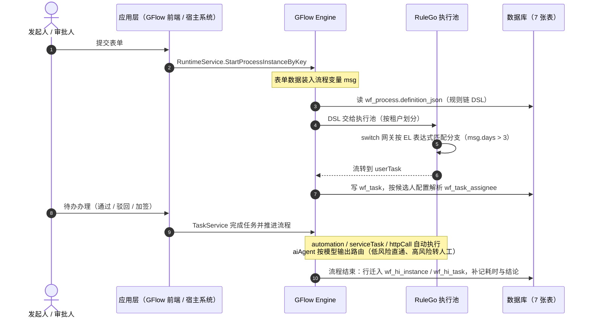

# 架构概览

五层自上而下：设计层、应用层、引擎层、规则引擎、存储层。每层可单独取用——GFlow Engine 能脱离平台嵌入你的系统，GFlow 也不锁死你的数据。

<ArchDiagram />

> 开源与商业的分界线在**引擎层**：引擎层及其以下（GFlow Engine、RuleGo）Apache-2.0 开源；设计层与应用层属于 GFlow Platform 商业版。

## 一次审批的数据流

1. **发起**：用户在 GFlow 前端提交表单，应用层调 `RuntimeService.StartProcessInstanceByKey`，表单数据装入流程变量 `msg`。
2. **路由**：引擎加载 `wf_process.definition_json` 中的规则链 DSL，交给 RuleGo 执行池（按租户划分）。
3. **网关**：`switch` 节点按 EL 表达式（如 `msg.days > 3`）匹配分支决定流向。
4. **任务**：流转到 `userTask` 节点时，引擎在 `wf_task` 写入任务行，按候选人配置解析 `wf_task_assignee`。
5. **办理**：审批人在前端对待办做出通过/驳回/加签等动作，`TaskService` 完成任务并推进流程。
6. **执行**：到达 `automation`（调规则链）、`serviceTask`（调 Go 函数）、`httpCall`（调外部接口）节点时**自动执行**后续动作——入账、开权限、发通知、回写 ERP；`aiAgent` 节点按模型输出路由（低风险直通、高风险转人工）。
7. **归档**：流程结束的瞬间，实例与任务行迁入 `wf_hi_instance` / `wf_hi_task`，补记耗时与结论。

## 关键设计决策

### 流程定义即规则链

流程 DSL 严格遵循 RuleGo `{ruleChain, metadata}` 标准：表单 schema、审批人、权限写在节点 `configuration` 与 `additionalInfo` 中，网关、并行分支直接复用 RuleGo 原生组件。**好处**：与 RuleGo 生态互通，已有的规则链可以直接当流程用，`automation` 节点反过来也能调用任意规则链。

### 运行时 / 历史双轨

进行中的实例和任务只保留「办理所需的最小字段集」，归档后补记 `duration`、`end_reason` 等。运行表永远小而热，历史表随便加索引做报表，两不相扰。详见[数据模型](/guide/data-model/)。

### 身份与引擎解耦

引擎不绑定任何用户体系。按角色/部门/主管发起的任务，办理人统一经 `service.IdentityService` 接口解析——生产环境注入宿主应用自己的实现即可对接真实组织架构，gflow 已内置完整实现（用户/角色/部门/岗位/多租户）。

### DSL 是唯一真相

UI 只是 DSL 的视图。设计器里配的每个节点、每条分支、每个字段权限，最终都落进 `definition_json`；任何 UI 状态丢失后都能从 DSL 完整重建。
